<div align="center">

# IRAS Tax Assistant

**A conversational Singapore tax assistant that answers GST, income tax, corporate tax, and SRS questions in plain language, calls real MCP-style tools, routes every query to the cheapest capable model across OpenAI and Anthropic, and escalates anything personal to a human.**

[](https://d1yl1box414d2i.cloudfront.net) &nbsp; &nbsp; &nbsp; &nbsp; &nbsp;

<a href="https://d1yl1box414d2i.cloudfront.net">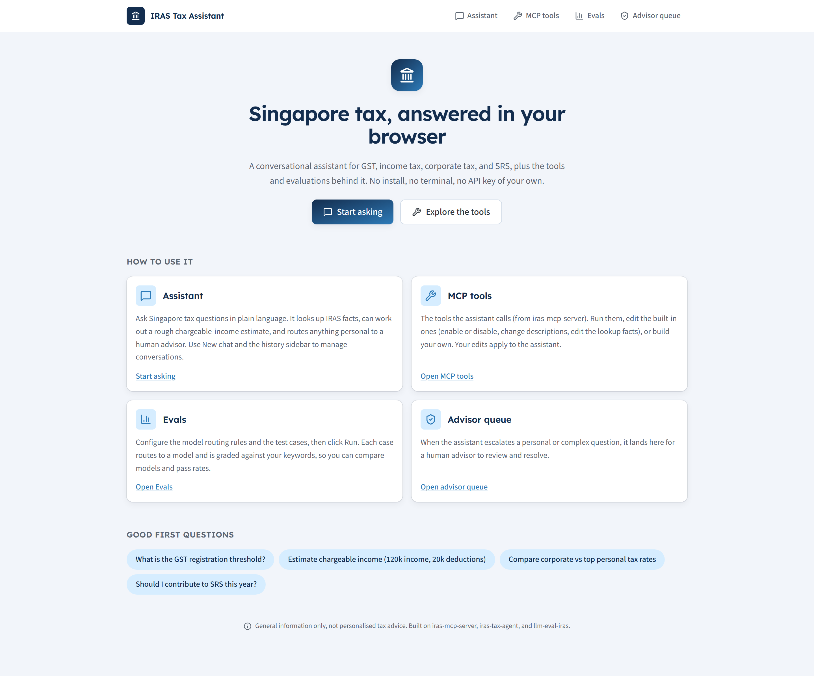</a>

</div>

---

## Table of contents

- [What it is](#what-it-is)
- [Feature tour](#feature-tour)
- [How a question flows](#how-a-question-flows)
- [Sequence: a chat turn](#sequence-a-chat-turn)
- [Sequence: human escalation](#sequence-human-escalation)
- [Logical architecture](#logical-architecture)
- [Physical architecture](#physical-architecture)
- [Deployment pipeline](#deployment-pipeline)
- [Data model](#data-model)
- [Spec-driven development](#spec-driven-development)
- [Tech stack](#tech-stack)
- [Local development](#local-development)
- [Deployment](#deployment)
- [Repository structure](#repository-structure)
- [Provenance and disclaimer](#provenance-and-disclaimer)

---

## What it is

Three command-line projects, an MCP tool server, a tax agent, and an LLM eval harness, made usable by anyone in a browser. No install, no terminal, no API key of your own.

- **Assistant.** Ask a Singapore tax question. It grounds factual answers in IRAS facts via a tool, can work out a rough chargeable-income estimate, and routes anything personal to a human advisor. Conversations have history and a New chat button, stored per browser.
- **Cheapest capable routing.** A deterministic rule engine picks a model per query from six models across OpenAI and Anthropic, so a simple lookup uses a cheap model and a complex comparison uses a premium one. Each answer shows which model handled it.
- **Configurable MCP tools.** The three built-in tools can be enabled, disabled, redescribed, and (for the lookup tool) have their facts edited. Visitors can also build their own lookup or template tools. Edits apply to the live assistant.
- **An eval workbench.** Edit the routing rules and the test cases, click Run, and watch each case route to a model and get graded, with a per-model pass-rate comparison.
- **Human in the loop.** Personalised questions are escalated to an advisor queue that a human resolves.

It is built on the [`elleskay/platform`](https://github.com/elleskay/platform) template: a Next.js to AWS serverless monorepo with a mandatory spec-driven test gate.

---

## Feature tour

### Assistant: tools and per-query model routing

A factual question calls the `lookup_tax_info` tool and is answered by the cheapest model the rules pick (here, GPT-4o mini). The chip under each answer reports the routed model.

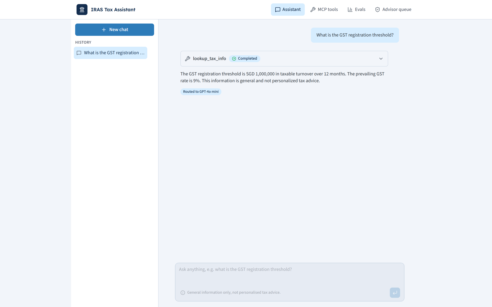

### MCP tools: configurable, and they drive the assistant

Enable or disable each built-in tool, edit its description, and edit the lookup tool's facts. Build your own tools too. Everything is sent with each chat request, so edits change the live assistant.

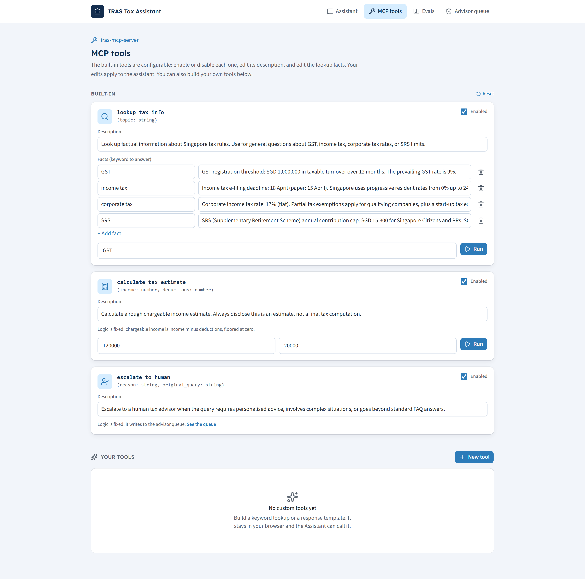

### Evals: configurable rules, runnable test cases, model comparison

Edit the routing rules (each model shows its approximate price) and the test cases, then Run. Each case routes to a model, is graded against keywords, and the results compare models side by side.

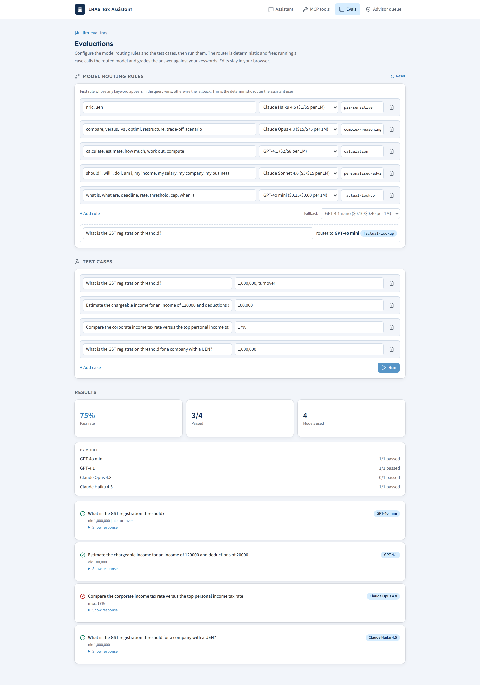

### Advisor queue: human in the loop

Escalated questions land here for a human to review and resolve.

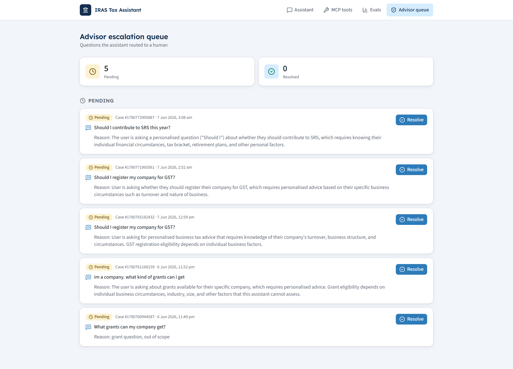

---

## How a question flows

The router is the cheap part: deterministic keyword rules, no extra model call. The model is only called to answer.

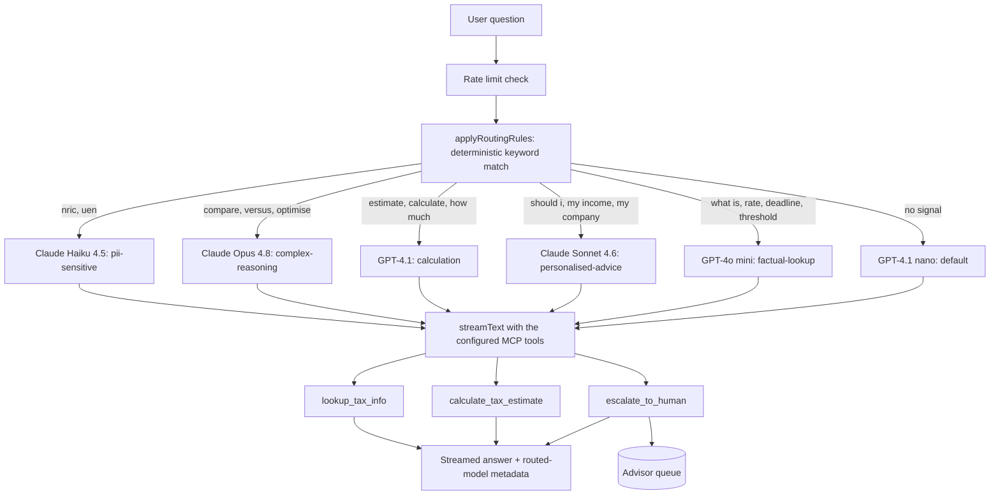

---

## Sequence: a chat turn

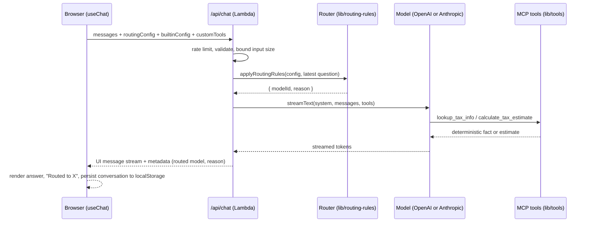

---

## Sequence: human escalation

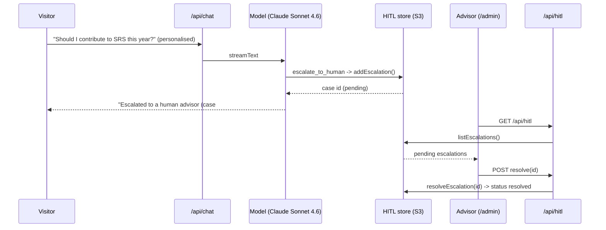

---

## Logical architecture

Pages, API routes, the pure domain libraries they call, and the external providers and stores. The router and tools are plain deterministic code; the models are the only network dependency for answering.

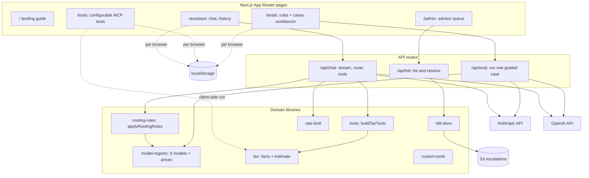

---

## Physical architecture

One CloudFront distribution fronts a streaming server Lambda (built by OpenNext), an image Lambda, and an S3 assets bucket. The server Lambda calls the model providers and a private S3 bucket for the escalation queue. There is no relational database.

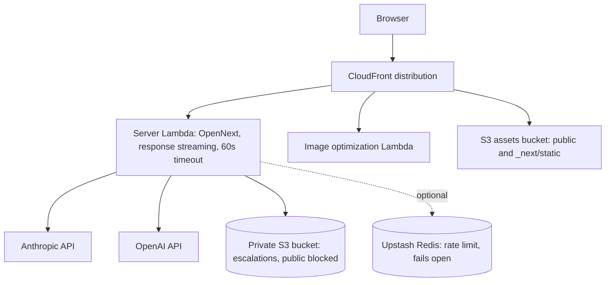

---

## Deployment pipeline

`deploy.yml` runs on push to main. It assumes an AWS role over OIDC (no stored keys), bakes the model keys in at synth, builds with OpenNext, runs CDK deploy, and the smoke test probes the live URL.

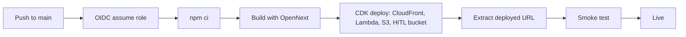

Secrets baked at synth and forwarded in the deploy step: `ANTHROPIC_API_KEY`, `OPENAI_API_KEY`, `ANTHROPIC_MODEL`. The HITL bucket name is a CDK token resolved at deploy time.

---

## Data model

No relational database. Two stores, chosen for what each needs:

- **Escalations** live in a private S3 bucket, one JSON object per case under `escalations/`, so concurrent Lambda writes never race on a shared file (locally and in tests, a JSON file is used instead). This is the only server-persisted entity.
- **Everything else is per browser** in `localStorage`: conversation history, the routing config, the eval test cases, the built-in tool config, and any custom tools. Nothing personal is stored server-side beyond an escalation the user explicitly triggers.


Server-persisted (S3): `ESCALATION`. Client-persisted (localStorage): `CONVERSATION`, `ROUTING_CONFIG`, `ROUTING_RULE`, `TEST_CASE`, `BUILTIN_TOOLS_CONFIG`, `CUSTOM_TOOL`.

---

## Spec-driven development

Every feature is written from a spec first. `specs/web.yml` lists each requirement with a unique ID, a category, a severity, and given/when/then criteria. Implementation and `specTest()` land in the same change. The gate (`npm run test:spec`) builds, runs the tests, and refuses to pass below 100 percent requirement coverage. `data` requirements run on Vitest (pure functions); `ui`, `functional`, `security`, and `a11y` run on Playwright. The LLM is non-deterministic, so chat and eval e2e stub the API with fixed fixtures and assert against them.

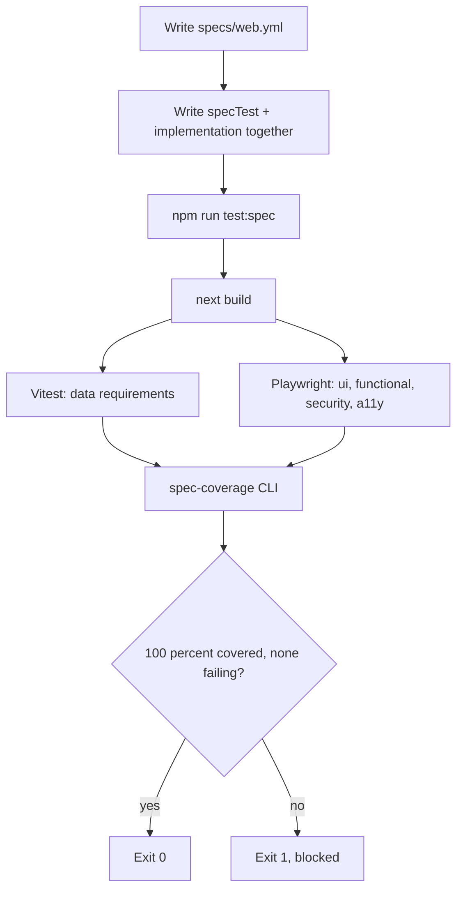

The 24 requirements currently covered:

<details>
<summary><strong>Show all 24 requirements</strong></summary>

| ID | Category | Requirement |
|---|---|---|
| IRAS-TAX-001 | data | Chargeable income is gross income minus deductions, floored at zero |
| IRAS-TAX-002 | data | Tax lookup returns the known fact for a supported topic |
| IRAS-HITL-001 | data | Escalation store supports create, list, and resolve |
| IRAS-ROUTER-001 | data | The deterministic routing rules pick the right model per query |
| IRAS-TOOLS-004 | data | Built-in tools respect their configuration (enable/disable, facts) |
| IRAS-RATELIMIT-001 | data | Rate limiting fails open when Upstash is not configured |
| IRAS-CHAT-001 | ui | Home page (assistant) renders the chat interface |
| IRAS-CHAT-003 | ui | A general-information disclaimer is always visible |
| IRAS-LANDING-001 | ui | Landing page guides the visitor and links into the assistant |
| IRAS-TOOLS-001 | ui | Tools page lists the MCP server tools |
| IRAS-EVAL-001 | ui | Evals page shows configurable routing rules and test cases |
| IRAS-CHAT-002 | functional | Sending a message shows the user message and the assistant reply |
| IRAS-CHAT-004 | functional | New chat clears the conversation and history keeps the previous one |
| IRAS-CHAT-005 | functional | A question deep link (`/assistant?q=`) asks it automatically |
| IRAS-NAV-001 | functional | Primary navigation links to every page |
| IRAS-TOOLS-002 | functional | A visitor can run the lookup tool and see a result |
| IRAS-TOOLS-003 | functional | A visitor can create a custom tool and run it |
| IRAS-EVAL-002 | functional | The route preview shows where a query routes |
| IRAS-EVAL-003 | functional | Running the test cases populates the result stats |
| IRAS-HITL-002 | functional | Admin page lists pending escalations |
| IRAS-HITL-003 | functional | Resolving an escalation marks it resolved end to end |
| IRAS-A11Y-001 | a11y | Page exposes a skip-to-content link and a single h1 |
| IRAS-A11Y-002 | a11y | The chat message input has an accessible label |
| IRAS-SEC-001 | security | Responses carry baseline security headers |

</details>

---

## Tech stack

| Layer | Choice |
|---|---|
| Framework | Next.js 16 (App Router), React 19, TypeScript strict |
| AI | Vercel AI SDK v6, `@ai-sdk/anthropic`, `@ai-sdk/openai`, `@ai-sdk/react` |
| Models | OpenAI: GPT-4.1 nano, GPT-4o mini, GPT-4.1. Anthropic: Claude Haiku 4.5, Sonnet 4.6, Opus 4.8 |
| UI | Tailwind CSS v4, shadcn/ui (Radix), AI Elements, lucide icons, IRAS colour palette |
| Routing | Deterministic keyword rules (no classifier call), configurable per browser |
| Tools | MCP-style `tool()` definitions, declarative and configurable, no eval of user input |
| Persistence | S3 for escalations, browser localStorage for everything client-side |
| Rate limit | Upstash Redis, fails open when unconfigured |
| Runtime | Node 22, AWS Lambda, response streaming |
| Hosting | CloudFront, S3, Lambda via OpenNext |
| IaC | AWS CDK (TypeScript) |
| CI/CD | GitHub Actions, OIDC deploys, no stored AWS keys |
| Testing | Vitest, Playwright, the `@platform/spec-test` gate at 100 percent coverage |

---

## Local development

```bash
cd apps/web
npm install
# add apps/web/.env.local with ANTHROPIC_API_KEY and OPENAI_API_KEY
npm run dev            # http://localhost:3000

npm run test:spec     # build + vitest + playwright + 100% coverage gate
```

Without API keys the UI still renders; only the live model calls fail. Rate limiting and the HITL store both fall back to local-friendly defaults (fail-open limiter, JSON file queue).

---

## Deployment

Pushing to `main` deploys automatically via `deploy.yml` (OIDC, OpenNext build, CDK deploy, smoke test). The model keys are GitHub Actions secrets, forwarded into the synth step and baked into the Lambda environment. The escalation bucket is provisioned by the CDK stack (`infra/cdk/web/lib/web-stack.ts`) with all public access blocked.

```bash
# one-off, from infra/cdk/web after configuring the OIDC role and repo secrets
gh secret set ANTHROPIC_API_KEY
gh secret set OPENAI_API_KEY
git push   # deploy.yml builds, deploys, and smoke-tests the live URL
```

---

## Repository structure

```
apps/web/
  app/
    page.tsx              Landing / guide
    assistant/page.tsx    Chat: routing, tools, history, deep links
    tools/page.tsx        Configurable MCP tools + custom tool builder
    evals/page.tsx        Routing-rule + test-case workbench
    admin/page.tsx        Advisor queue
    api/chat              Streamed chat: route, tools, metadata
    api/eval              Run one graded eval case on a chosen model
    api/hitl              List and resolve escalations
  lib/
    routing-rules.ts      Deterministic router + config + storage
    model-registry.ts     Six models, tiers, approximate prices
    tools.ts / tax.ts     buildTaxTools + facts + estimate
    builtin-tools.ts      Configurable built-in tool definitions
    custom-tools.ts       User-defined lookup / template tools
    conversations.ts      Chat history (localStorage)
    hitl-store.ts         S3 (prod) or file (dev) escalation store
    rate-limit.ts         Upstash limiter, fails open
  specs/web.yml           24 requirements, the source of truth
  tests/                  Vitest (data) + Playwright (ui/functional/security/a11y)
infra/cdk/web/            NextjsServerless construct + HITL bucket stack
.github/workflows/        deploy.yml (OIDC, OpenNext, CDK, smoke test)
```

---

## Provenance and disclaimer

Built on the [`elleskay/platform`](https://github.com/elleskay/platform) template, and showcases three command-line projects in one browser app: an MCP tax-tool server, a tax agent, and an LLM eval harness.

This is a demonstration. It provides general information about Singapore tax, not personalised tax advice. Tax figures shown are illustrative and may not reflect current IRAS rules; always confirm with IRAS or a qualified professional.
