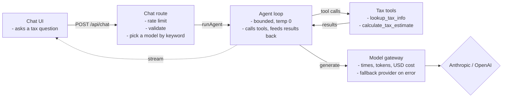
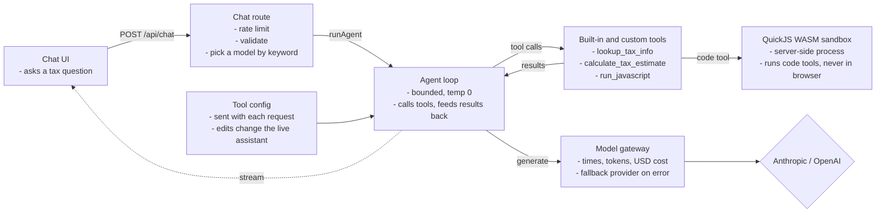
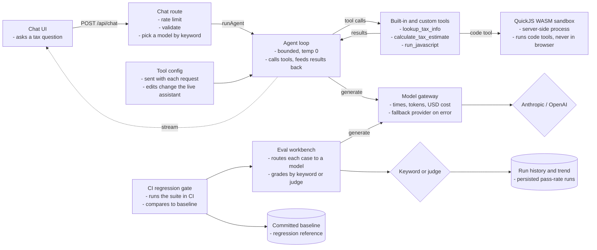
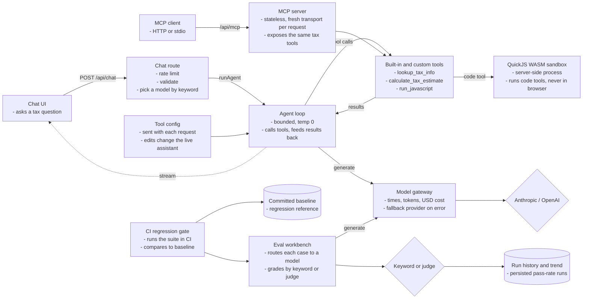
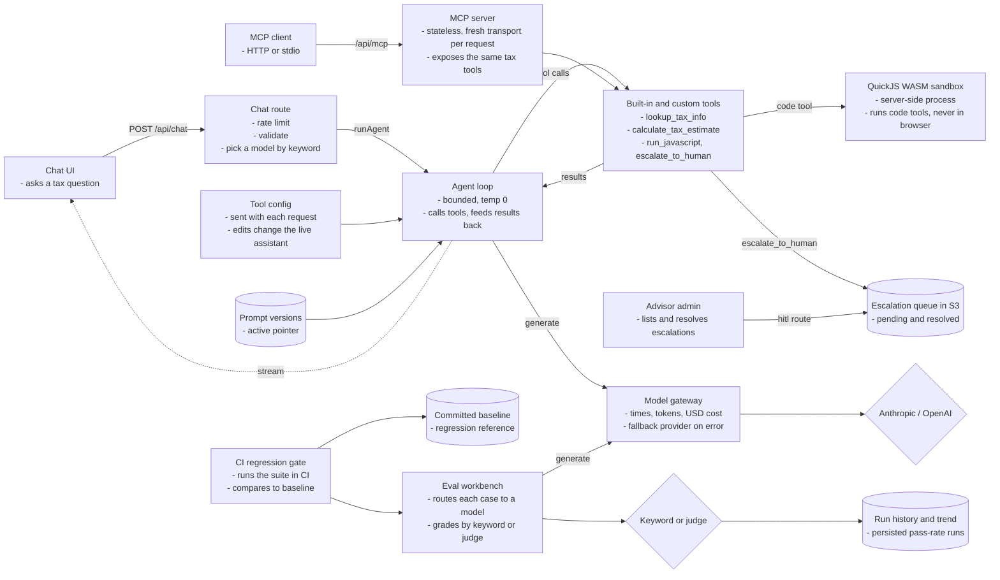
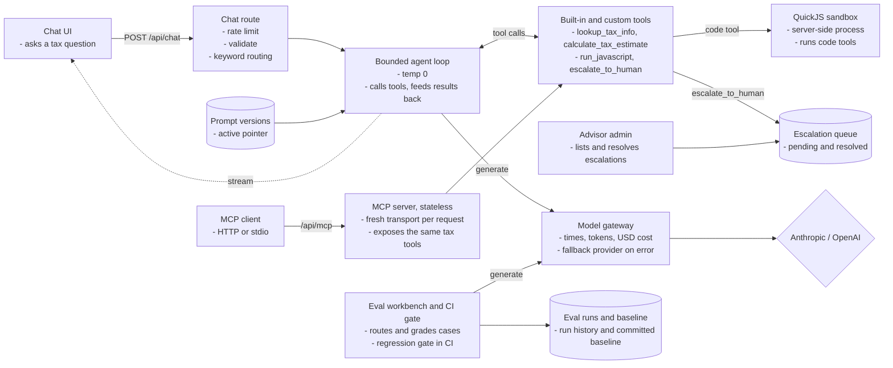

# IRAS Tax Assistant System Design

> A system design breakdown of the Unofficial IRAS Tax Assistant, a multi-step Singapore tax agent. It answers GST, income, corporate, and SRS questions in plain language by chaining real tools with a visible step trace, routes each query cost-aware across six models through one observed gateway, runs visitor-written code in a secure sandbox, exposes its tools over MCP, and escalates anything personal to a human.
>
> **Live demo** at https://iras.soonkeong.dev
>
> Unofficial. Not affiliated with the Inland Revenue Authority of Singapore. General information for demonstration, not personalised tax advice, and the figures are illustrative.

---

## Understanding the Problem

People ask Singapore tax questions in plain language, and the answers must be grounded in real facts, never invented, with anything personal handed to a human. This app is also a showcase of the seven artifacts of AI-native engineering, an agent loop, a model gateway, an evaluation harness, prompt management, an internal MCP server, a secure sandbox, and AI-assisted code review, each a working feature rather than a slide.

The defining constraints are trust and cost, not scale. A tax answer must be grounded and safe, every model call must be observable and cheap, and visitor-written code must run without endangering the host. And because a non-deterministic model sits in the loop, the whole thing must still be testable in CI without ever calling an LLM. Everything else follows from that.

### Functional Requirements

- Users should be able to ask a tax question and get a grounded answer with a visible numbered step trace of the tools used.
- Users should be able to see which of six models answered, with the tokens and the dollar cost of the reply.
- Users should be able to configure the built-in tools and build their own (lookup, template, or sandboxed code), used live by the assistant.
- Users should be able to run an eval workbench, routing test cases to models and grading them by keyword or LLM judge, with a persisted run history.
- Users should be able to call the tax tools over MCP, both Streamable HTTP and stdio.
- Personal questions should be escalated to a human advisor queue.

Out of scope: it is unofficial and not affiliated with IRAS, it is not personalised advice, and no personal data is stored server-side beyond an escalation the user explicitly triggers.

### Non-Functional Requirements

- Answers should be grounded in a tool and safe, factual replies come from a lookup tool and personal questions escalate to a human.
- Routing should be cost-aware and add no latency or cost, cheap models for simple queries, premium for hard ones.
- Every model call should be observable, timed, token-counted, and priced.
- Visitor-written code should run with hard time, memory, and output limits and no host access.
- The system should be deterministically testable despite the model, and CI must never call an LLM.
- The system should run near-zero cost with no database, scale-to-zero on AWS.

---

## The Set Up

### Planning the Approach

The assistant is one bounded agent loop behind a single chat route. Routing is deterministic keyword rules, so picking a model costs nothing, and every model call funnels through one gateway that times, prices, logs, and falls back. There is no database, server state is small flat records in one private S3 bucket, and everything else lives in the browser. The whole thing is gated by a spec so it cannot ship untested. Trust and cost first, then everything else.

### Defining the Core Entities

There is no relational database. Server state is one private S3 bucket through a generic JSON store, one object per record under a prefix, with reverse-chronological ids so a list is newest-first with no sort key.

- **Escalation** (S3 escalations/), one personal question handed to the advisor queue, with a status of pending or resolved.
- **GatewayCall** (S3 gateway/), one logged model call, with model, latency, tokens, cost, and whether the fallback fired.
- **PromptVersion** (S3 prompts/), an immutable system-prompt version behind an activation pointer.
- **EvalRun** (S3 eval-runs/), one persisted eval run with its grader and prompt version.
- Client-side in localStorage: **Conversation**, the **RoutingConfig** and its ordered **RoutingRule** list, **TestCase**, the built-in **ToolConfig**, and any **CustomTool**.

### API or System Interface

A set of Next.js route handlers, plus the MCP server. The server owns model choice, cost, and timestamps, so the client only ever sends its turns.

Chat endpoint. This is the heart of the app. A POST carries the conversation so far, and the server picks a model by keyword, runs the bounded agent loop calling tools as needed, and streams the answer back token by token with the routed model, token counts, and cost attached. POST because each turn drives fresh server-side work, not a cacheable read.

```
POST /api/chat -> streamed answer
Body: {
  messages
}
```

Eval endpoint. This scores the assistant on a single test case. A POST runs one case against a chosen model and grader, either keyword matching or an LLM judge, and returns the graded verdict. POST because a run is a fresh evaluation, not a lookup.

```
POST /api/eval -> EvalResult
Body: {
  question, expects, modelId?, promptVersion?, grader?, rubric?
}
```

Eval runs endpoint. Completed runs are kept so the workbench can show a trend. A POST persists a finished run, and a GET lists the run history for the pass-rate sparkline.

```
POST /api/eval/runs -> Run
GET  /api/eval/runs -> Run[]
```

Prompts endpoint. The system prompt is a small versioned registry, not a constant. A GET lists the versions, a POST adds a new immutable one, and a PUT moves the active pointer, so the live prompt can change without a redeploy.

```
GET  /api/prompts -> Prompt[]
POST /api/prompts -> Prompt
PUT  /api/prompts -> Prompt
```

Tool run endpoint. Custom tools execute server-side, never in the browser. A POST sends the tool definition and an input, and the server runs it, including user-written code inside the QuickJS sandbox, then returns the result. POST because it executes rather than reads.

```
POST /api/tools/run -> ToolResult
Body: {
  tool, input
}
```

Escalation endpoint. This is the human-in-the-loop queue. A GET lists all escalations, pending and resolved, for an advisor, a POST is how the agent files one when a question needs a human, and a PATCH marks one resolved.

```
GET   /api/hitl -> Escalation[]
POST  /api/hitl -> Escalation
PATCH /api/hitl -> Escalation
```

MCP endpoint. The same tax tools are exposed over the Model Context Protocol so any MCP client can call them. It runs as a stateless Streamable HTTP server at this route, and over stdio for local clients like Claude Code.

```
GET POST DELETE /api/mcp
tools: lookup_tax_info, calculate_tax_estimate, escalate_to_human (bearer-gated when MCP_API_KEY is set), run_javascript
```

---

## High-Level Design

We build the design one functional requirement at a time.

### 1) A user asks a question and gets a grounded answer

A chat request is rate-limited and validated, then deterministic rules pick a model by keyword, the system prompt resolves from its active version, and the bounded agent loop runs through the gateway, calling tools and feeding results back until it has an answer. The reply streams with the routed model, tokens, and cost.

We start with the request spine: rate-limit and validate, route to a model, run the bounded loop through the gateway, stream back.



### 2) A user configures and builds tools, used live

The built-in tools can be enabled, disabled, redescribed, and (for lookup) have their facts edited, and visitors can build lookup, template, or sandboxed code tools. The whole tool config is sent with each chat request, so edits change the live assistant. Code tools run server-side in the sandbox, never in the browser.

We add the tool config that rides with each request, and the sandbox that code tools run in.



### 3) A user evaluates routing and answers

The eval workbench routes each test case to a model and grades it, by keyword (names the missed words) or by an LLM judge (a structured verdict that fails closed). Runs persist with a pass-rate trend, and the same suite runs in CI against a committed baseline as a regression gate.

The eval workbench and the CI gate hang off the same gateway, so test runs are timed and costed like any other call.



### 4) A client calls the tools over MCP

The tax tools are a real MCP server, stateless by design, a fresh transport per request, exposed over Streamable HTTP at /api/mcp and over stdio for local clients. The escalation tool is bearer-gated with a constant-time check when a key is configured.

We expose the same tools to outside clients over MCP, without a second implementation.



### 5) A personal question is escalated to a human

When the agent calls escalate_to_human, it writes a pending escalation to the S3 queue and tells the user. An advisor lists and resolves it from the admin page through the hitl route. The push to act is a human reading the queue, not the model deciding.

The last pieces are the versioned prompt that feeds the agent and the human escalation path. That completes the logical design.



---

## Potential Deep Dives

### 1) How do we pick a model cheaply without adding latency?

Each query should use the cheapest capable model, and the choice itself should be free.

<details>
<summary><strong>Bad solution: one model for everything</strong></summary>

Send every query to a single model. Simple, but you either overpay by using a premium model for trivial lookups, or underperform by using a cheap one for hard reasoning.
</details>

<details>
<summary><strong>Good solution: an LLM classifier picks the model</strong></summary>

Ask a small model to classify the query and route on its answer. Flexible, but it adds a model call, and therefore latency and cost, to every single message, and it is hard to test.
</details>

<details>
<summary><strong>Great solution: deterministic keyword rules</strong></summary>

Route on first-matching keyword rules across six models. The choice is an instant map lookup, free and fully unit-tested, and visitors can edit the rules live. The trade-off is brittleness on novel phrasing, acceptable in a scoped tax domain. This is what the app runs.
</details>

### 2) How do we observe and harden every model call?

Many call sites hit the providers, and each needs timing, cost, and resilience.

<details>
<summary><strong>Bad solution: call the providers directly at each site</strong></summary>

Let chat, evals, and the judge each call the SDK. No consistent timing or cost, no fallback, and observability is scattered or missing.
</details>

<details>
<summary><strong>Good solution: a logging helper</strong></summary>

Wrap calls in a helper that logs. Better, but it is easy to bypass, and on Lambda the log write can be dropped if it is fired after the response closes and the environment freezes.
</details>

<details>
<summary><strong>Great solution: one gateway via model middleware</strong></summary>

Wrap the model with wrapLanguageModel so every call passes one chokepoint that times it, extracts token usage, computes USD cost from registry prices, retries once on the other provider on error, and awaits the log write before the stream closes. Observability and resilience live in one place. This is what the app runs.
</details>

### 3) How do we run visitor-written code without endangering the host?

Visitors can write JavaScript tools, which is arbitrary untrusted code.

<details>
<summary><strong>Bad solution: eval it on the server</strong></summary>

Run the code in the Node process. It has full access to the filesystem, network, and environment, so a single hostile snippet owns the server.
</details>

<details>
<summary><strong>Good solution: a Node vm context</strong></summary>

Use a vm sandbox. Better, but vm is not a security boundary, escapes are well known, and it does not bound CPU or memory.
</details>

<details>
<summary><strong>Great solution: QuickJS compiled to WASM</strong></summary>

Run the code in QuickJS inside WebAssembly, a fresh context per call with a roughly 1 second deadline, a 32MB memory cap, an 8KB output cap, and no fetch, process, require, or filesystem. Input and output cross as JSON strings only, so there is no host reference to follow. This is what the app runs.
</details>

### 4) How do we persist server state with no database?

The server keeps small records, escalations, logs, prompt versions, runs, and concurrent Lambdas must not corrupt them.

<details>
<summary><strong>Bad solution: one JSON file in the bucket</strong></summary>

Keep all records in a single JSON object. Two Lambdas reading, modifying, and rewriting it at once race, and one silently overwrites the other.
</details>

<details>
<summary><strong>Good solution: a managed database</strong></summary>

Stand up Postgres. Correct, but it bills around the clock and is heavy for a handful of flat records with no relational queries.
</details>

<details>
<summary><strong>Great solution: one S3 object per record</strong></summary>

Write one object per record under a prefix per entity, with a reverse-chronological id so a plain list returns newest-first with no sort index. Concurrent writers never touch the same object, and there is nothing to pay for when idle. This is what the app runs.
</details>

### 5) How do we keep the agent from looping forever or inventing tax facts?

A free-running model can loop on tools or confidently make up a figure.

<details>
<summary><strong>Bad solution: a single free-form completion</strong></summary>

Ask the model to answer in one shot from its own knowledge. It cannot look anything up, so it invents thresholds and rates, which is the worst outcome for tax.
</details>

<details>
<summary><strong>Good solution: tools but an unbounded loop</strong></summary>

Give it tools and let it call them freely. Grounded, but a confused model can call tools in a loop with no stop, burning time and money.
</details>

<details>
<summary><strong>Great solution: a bounded, grounded loop</strong></summary>

Run a tool loop capped with stopWhen at a small number of steps, at temperature 0, where factual answers come from the lookup tool and personal ones escalate to a human. Bounded spend, grounded facts, and a visible step trace of exactly what was called. This is what the app runs.
</details>

### 6) How do we test an LLM-backed app deterministically in CI?

The model is non-deterministic, but the build must be repeatable and free.

<details>
<summary><strong>Bad solution: call the real model in tests</strong></summary>

Hit the providers in the test suite. Flaky, slow, costs money on every run, and a model change turns the build red for no code reason.
</details>

<details>
<summary><strong>Good solution: record and replay responses</strong></summary>

Capture real responses once and replay them. Deterministic, but the fixtures drift from reality and must be re-recorded.
</details>

<details>
<summary><strong>Great solution: mocks, stubs, and a spec gate</strong></summary>

Unit tests drive the agent with scripted mock models, and chat and eval e2e stub the streamed response with fixed fixtures, so no test ever calls an LLM. A spec maps each of the 57 requirements to a passing test, and the gate blocks the build below 100 percent. Live model calls happen only in two opt-in CI workflows, the AI review and the eval gate. This is what the app runs.
</details>

---

## The complete design

Pulling the high-level design and the deep dives together, here is the whole system in one view. It deploys as one CloudFront distribution over an OpenNext streaming server Lambda (60s), with assets on S3, server state in a private S3 bucket, and optional Upstash for rate limiting. There is no database.



## Tech stack

| Layer | Tech |
|---|---|
| Framework | Next.js 16 (App Router), React 19, TypeScript strict |
| AI | Vercel AI SDK v6 with the Anthropic and OpenAI providers |
| Models | OpenAI GPT-4.1 nano, GPT-4o mini, GPT-4.1, and Anthropic Claude Haiku 4.5, Sonnet 4.6, Opus 4.8 |
| Routing | Deterministic keyword rules, no classifier call, configurable per browser |
| Gateway | wrapLanguageModel middleware for latency, tokens, cost, cross-provider fallback, and persisted logs |
| Tools | Configurable tool definitions plus a real MCP server (mcp-handler, the MCP SDK) over Streamable HTTP and stdio |
| Sandbox | QuickJS compiled to WASM, a roughly 1 second deadline, 32MB and 8KB caps, no host globals |
| Evals | Keyword and LLM-as-judge graders, persisted history, a CLI baseline gate in CI |
| Prompts | A versioned store with an activation pointer and a line diff |
| Persistence | One private S3 bucket via a generic JSON store, plus browser localStorage |
| Infra | AWS Lambda, S3, CloudFront via OpenNext, provisioned with AWS CDK |
| Testing | Vitest, Playwright, the spec-test gate at 57 of 57, AI review and an eval gate on PRs |
| Built on | the [platform template](https://github.com/elleskay/platform) |

## License

MIT.
