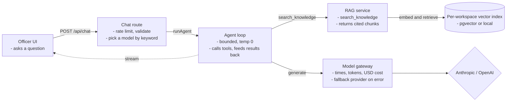
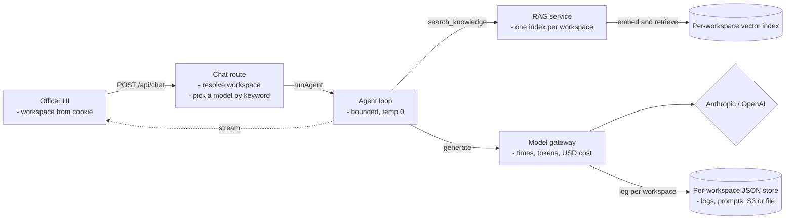
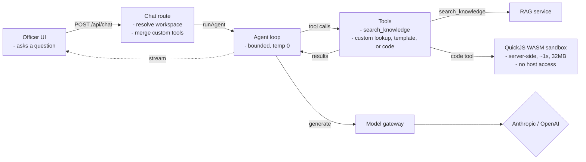
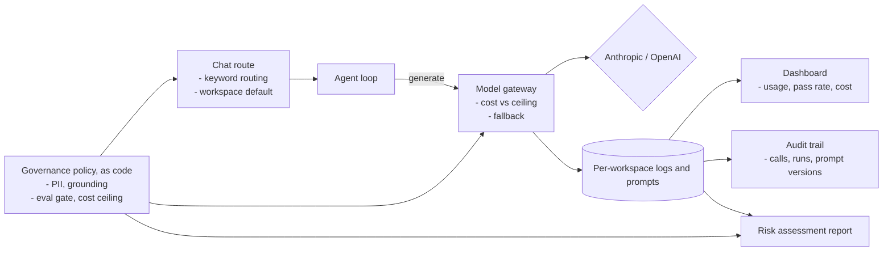
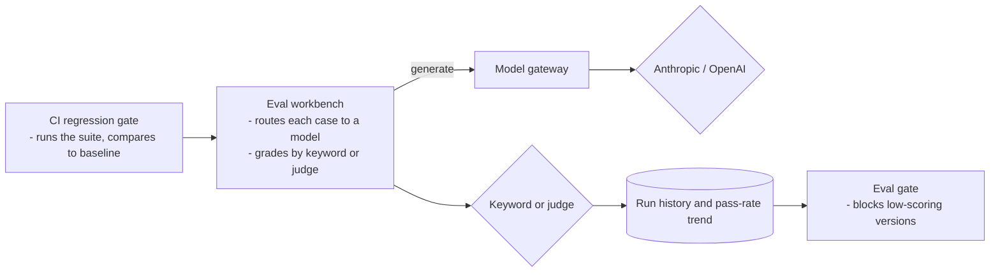
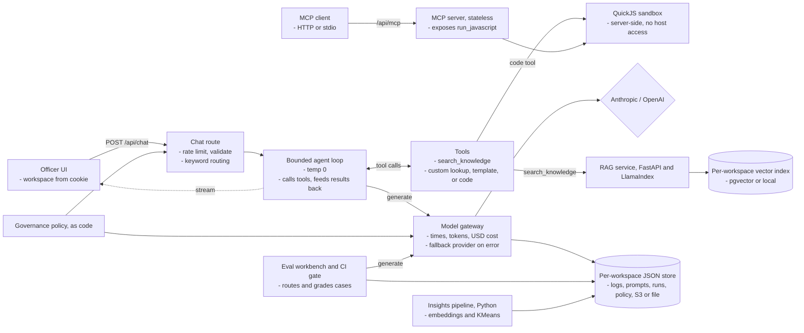

# AI Tax Assistant Platform System Design

> A system design breakdown of the Unofficial AI Tax Assistant Platform, a multi-tenant tool for Singapore tax officers. Each department gets its own workspace and a document-grounded assistant: officers ask questions, draft replies for review, and triage cases, grounded in the workspace's own documents (RAG) and cited. Every query is routed cost-aware across six models through one observed gateway, custom tools run in a secure sandbox, and the whole platform runs under one governance standard expressed as code: PII handling, grounding, an eval gate, a cost ceiling, a full audit trail.
>
> **Live demo** at https://ai-tax.soonkeong.dev
>
> Unofficial. Not affiliated with the Inland Revenue Authority of Singapore. General information for demonstration, not personalised tax advice, and the figures are illustrative.

---

## Understanding the Problem

Tax officers handle taxpayer queries and casework for their department (Individual Income, Corporate, GST, and so on). They need an assistant grounded in their own guidance, never inventing figures, that drafts replies for the officer to review rather than sending anything. Each department's documents and usage differ, so the product is multi-tenant: one workspace per department. And because the whole agency answers to one set of rules, every workspace must run under a single governance standard rather than drifting apart.

The defining constraints are trust, isolation, and cost, not scale. Answers must be grounded and cited, tenants must not leak into one another, every model call must be observable and cheap, officer-written code must run without endangering the host, and the platform must enforce one governance standard while letting each workspace bring its own documents and instructions. Because a non-deterministic model sits in the loop, the whole thing must still be testable in CI without ever calling an LLM.

### Functional Requirements

- Officers should be able to ask a question and get an answer grounded in the workspace's own documents, with inline citations and a visible numbered step trace of the tools used.
- Officers should be able to work in one workspace per department; the whole app, assistant, documents, instructions, analytics, gateway, scopes to the active workspace, and new workspaces can be created self-serve.
- Officers should be able to upload a workspace's guidance documents, which are chunked, embedded, and indexed per workspace for retrieval.
- Officers should be able to see which of six models answered, with the tokens and the dollar cost of the reply.
- Officers should be able to build their own tools (lookup, template, or sandboxed code), used live by the assistant.
- Officers should be able to version the assistant's instructions (the system prompt) behind an activation pointer.
- Officers should be able to run an eval workbench, routing test cases to models and grading them by keyword or LLM judge, with a persisted run history behind a pass-rate gate.
- The platform should enforce one governance standard across every workspace (PII detect/redact/audit, grounding, eval gate, cost ceiling, deterministic routing), with a live dashboard, a full audit trail, and a downloadable risk assessment.

Out of scope: it is unofficial and not affiliated with IRAS, it is not personalised advice, and it is officer-facing (it serves the officer, not the taxpayer). There is no auth in the demo: the active workspace comes from a cookie.

### Non-Functional Requirements

- Answers should be grounded and cited, coming from the workspace's retrieved documents, and PII is handled and audited in casework, never used to route or escalate.
- Tenants should be isolated: one workspace's documents, stores, and instructions never bleed into another, and one governance standard applies to all.
- Routing should be cost-aware and add no latency or cost: cheap models for simple queries, premium for hard ones.
- Every model call should be observable (timed, token-counted, priced) and resilient (cross-provider fallback).
- Officer-written code should run with hard time, memory, and output limits and no host access.
- The system should be deterministically testable despite the model, and CI must never call an LLM.
- The system should run near-zero cost with no relational database, scale-to-zero on AWS.

---

## The Set Up

### Planning the Approach

The assistant is one bounded agent loop behind a single chat route, scoped to a workspace. Routing is deterministic keyword rules, so picking a model costs nothing, and every model call funnels through one gateway that times, prices, logs, and falls back. Grounding is retrieval: a separate Python RAG service holds one vector index per workspace, and the agent's `search_knowledge` tool queries it. There is no relational database; server state is small flat records in a per-workspace JSON store (S3 in production, files locally). The governance standard is one declarative policy, enforced in the routing, eval, and gateway layers and surfaced on a dashboard and audit trail. The whole thing is gated by a spec so it cannot ship untested. Trust, isolation, and cost first, then everything else.

### Defining the Core Entities

There is no relational database. App state is a generic JSON store, one object per record under a prefix, keyed by workspace, with reverse-chronological ids so a list is newest-first with no sort key. Document vectors live in the RAG service.

- **Workspace** (store `workspaces`), one department's space: name, tax type, blurb, and a few tuning knobs (default model, cost ceiling).
- **RAG index** (RAG service, per workspace), the workspace's uploaded documents, chunked and embedded into its own vector index (a pgvector table or a local store), with per-chunk `doc_id`, filename, and location for citation and deletion.
- **GatewayCall** (store `gateway-<workspace>`), one logged model call: model, latency, tokens, USD cost, route reason, and whether the fallback fired.
- **PromptVersion** (store `prompts-<workspace>`), an immutable instruction version behind an activation pointer.
- **EvalRun** (store `eval-runs`, platform-wide), one persisted eval run with its grader, prompt version, and pass rate.
- **GovernancePolicy** (store `governance-policy`, platform-wide), the editable policy overrides merged over the code defaults.
- Client-side in localStorage: **Conversation** (per workspace), the **RoutingConfig** and its ordered **RoutingRule** list, **TestCase**, and any **CustomTool**.

### API or System Interface

A set of Next.js route handlers plus the MCP server. The server owns model choice, cost, timestamps, and workspace resolution, so the client only ever sends its turns.

Chat endpoint. The heart of the app. A POST carries the conversation and the browser's routing config; the server resolves the workspace (cookie), picks a model by keyword, runs the bounded agent loop calling tools as needed, and streams the answer back with the routed model, token counts, and cost attached.

```
POST /api/chat -> streamed answer
Body: { messages, routingConfig?, tools? }
```

Knowledge endpoint. The per-workspace RAG corpus. A GET lists the workspace's documents and reports whether the RAG service is configured and reachable, a POST indexes an uploaded document, and a DELETE removes one. The assistant's `search_knowledge` tool queries the service directly during a turn.

```
GET    /api/knowledge -> { enabled, reachable, documents }
POST   /api/knowledge -> indexes a document
DELETE /api/knowledge -> removes a document
GET    /api/knowledge/download -> the original file
```

Workspaces endpoint. A GET lists the platform's workspaces (the seeds plus any created), a POST creates one, and a PATCH updates its settings.

```
GET   /api/workspaces -> Workspace[]
POST  /api/workspaces -> Workspace
PATCH /api/workspaces -> Workspace
```

Prompts endpoint. The instructions are a small versioned registry per workspace, not a constant. A GET lists versions, a POST adds a new immutable one, and a PUT moves the active pointer, so the live prompt changes without a redeploy.

```
GET  /api/prompts -> Prompt[]
POST /api/prompts -> Prompt
PUT  /api/prompts -> Prompt
```

Tool run endpoint. Custom tools execute server-side, never in the browser. A POST sends the tool definition and an input, and the server runs it, including officer-written code inside the QuickJS sandbox, then returns the result.

```
POST /api/tools/run -> ToolResult
Body: { tool, input }
```

Eval endpoints. A POST scores one test case against a chosen model and grader (keyword or LLM judge); a separate route persists finished runs and lists the history for the pass-rate trend.

```
POST /api/eval      -> EvalResult
POST /api/eval/runs -> Run
GET  /api/eval/runs -> Run[]
```

Governance endpoints. The platform policy is editable and exportable. A GET returns the effective policy, a PUT saves overrides, and the report route renders a downloadable AI Risk Assessment.

```
GET /api/governance/policy -> { policy, overrides }
PUT /api/governance/policy -> { policy }
GET /api/governance/report -> risk assessment (.md)
```

MCP endpoint. The deterministic sandbox tool is exposed over the Model Context Protocol so any MCP client can call it. It runs as a stateless Streamable HTTP server at `/api/mcp`, and over stdio for local clients like Claude Code.

```
GET POST DELETE /api/mcp
tools: run_javascript (QuickJS sandbox; no LLM)
```

---

## High-Level Design

We build the design one functional requirement at a time.

### 1) An officer asks a question and gets a document-grounded, cited answer

A chat request is rate-limited and validated, then deterministic rules pick a model by keyword, the workspace's active instructions resolve, and the bounded agent loop runs through the gateway. Its `search_knowledge` tool retrieves cited passages from the workspace's RAG index, and the reply streams with the routed model, tokens, and cost.



### 2) Each department works in an isolated workspace

The active workspace comes from a cookie, and every server store is keyed by it: documents, gateway logs, instructions, and conversations are all scoped, and the RAG service keeps a separate vector index per workspace. One standard is shared; what differs per workspace is its documents, its instructions, and its default model.



### 3) An officer builds tools, used live

The assistant's only built-in tool is `search_knowledge`. Everything else is officer-built: lookup tables, message templates, or sandboxed code, sent with each chat request so edits change the live assistant. Code tools run server-side in a QuickJS WASM sandbox, never in the browser.



### 4) The platform is governed to one standard, observed and audited

One declarative policy (PII handling, grounding, an eval gate, a cost ceiling) plus the deterministic routing rules are enforced in the routing, eval, and gateway layers. The dashboard aggregates usage, eval pass rate, cost, and reliability across all workspaces; the audit trail records every model call, eval run, and instruction version; and the policy is exportable as a risk assessment.



### 5) An officer evaluates routing and answers

The eval workbench routes each test case to a model and grades it, by keyword (names the missed words) or by an LLM judge (a structured verdict that fails closed). Runs persist with a pass-rate trend, the same gate the governance dashboard reads, and run in CI against a committed baseline as a regression gate. Evaluation hangs off the same gateway, so test runs are timed and costed like any other call.



---

## Potential Deep Dives

### 1) How do we pick a model cheaply without adding latency?

Each query should use the cheapest capable model, and the choice itself should be free.

<details>
<summary><strong>Bad solution: one model for everything</strong></summary>

Send every query to a single model. Simple, but you either overpay by using a premium model for trivial lookups, or underperform by using a cheap one for hard reasoning.
</details>

<details>
<summary><strong>Good solution: an LLM classifier picks the model</strong></summary>

Ask a small model to classify the query and route on its answer. Flexible, but it adds a model call, and therefore latency and cost, to every message, and it is hard to test.
</details>

<details>
<summary><strong>Great solution: deterministic keyword rules</strong></summary>

Route on first-matching keyword rules across six models, falling back to the workspace's default model. The choice is an instant map lookup, free and fully unit-tested, the route reason is logged on every call, and officers can edit the rules live. The trade-off is brittleness on novel phrasing, acceptable in a scoped tax domain. This is what the platform runs.
</details>

### 2) How do we observe and harden every model call?

Many call sites hit the providers, and each needs timing, cost, and resilience.

<details>
<summary><strong>Bad solution: call the providers directly at each site</strong></summary>

Let chat, evals, and the judge each call the SDK. No consistent timing or cost, no fallback, and observability is scattered or missing.
</details>

<details>
<summary><strong>Good solution: a logging helper</strong></summary>

Wrap calls in a helper that logs. Better, but it is easy to bypass, and on Lambda the log write can be dropped if it is fired after the response closes and the environment freezes.
</details>

<details>
<summary><strong>Great solution: one gateway via model middleware</strong></summary>

Wrap the model with `wrapLanguageModel` so every call passes one chokepoint that times it, extracts token usage, computes USD cost from registry prices, retries once on the other provider on error, logs per workspace, and awaits the log write before the stream closes. Observability and resilience live in one place. This is what the platform runs.
</details>

### 3) How do we isolate tenants without standing up a deployment per department?

Every department's documents, logs, and instructions must stay separate, but spinning up infrastructure per tenant is wasteful.

<details>
<summary><strong>Bad solution: one shared store with a tenant column</strong></summary>

Keep everything in shared tables or files filtered by a workspace field. One missing filter leaks another department's documents or logs, and the blast radius of a bug is every tenant.
</details>

<details>
<summary><strong>Good solution: a deployment per workspace</strong></summary>

Stand up a separate app and database per department. Strong isolation, but it multiplies cost and operations by the number of tenants and makes a shared governance standard hard to enforce.
</details>

<details>
<summary><strong>Great solution: one app, key-prefixed per workspace</strong></summary>

Run one app where every store is the same `createJsonStore` keyed by workspace (`prompts-<workspace>`, `gateway-<workspace>`), and the RAG service holds a physically separate vector index per workspace. The active workspace comes from a cookie. Isolation is structural (different keys, different indices), the governance standard is shared by construction, and there is nothing extra to pay for per tenant. This is what the platform runs.
</details>

### 4) How do we ground answers in each department's own documents?

A tax answer must come from the department's guidance, with a citation, not the model's memory.

<details>
<summary><strong>Bad solution: stuff documents into the prompt</strong></summary>

Paste the guidance into the system prompt. It blows the context window as the corpus grows, costs tokens on every call, and gives no per-passage citation.
</details>

<details>
<summary><strong>Good solution: embed in the app and search in memory</strong></summary>

Embed documents inside the Next.js app and do similarity search in process. Workable at toy scale, but it bloats the serverless bundle, recomputes on cold starts, and has no real vector index.
</details>

<details>
<summary><strong>Great solution: a dedicated RAG service with a per-workspace index</strong></summary>

Run a Python FastAPI + LlamaIndex service that chunks and embeds (OpenAI `text-embedding-3-small`) into one vector index per workspace (pgvector on Neon, or a local store), returning passages with `doc_id`, filename, and location. The agent's `search_knowledge` tool calls it and cites `[n]` per passage. When the service is unset, retrieval is simply disabled and the app still runs. This is what the platform runs.
</details>

### 5) How do we run officer-written code without endangering the host?

Officers can write JavaScript tools, which is arbitrary untrusted code.

<details>
<summary><strong>Bad solution: eval it on the server</strong></summary>

Run the code in the Node process. It has full access to the filesystem, network, and environment, so a single hostile snippet owns the server.
</details>

<details>
<summary><strong>Good solution: a Node vm context</strong></summary>

Use a `vm` sandbox. Better, but `vm` is not a security boundary, escapes are well known, and it does not bound CPU or memory.
</details>

<details>
<summary><strong>Great solution: QuickJS compiled to WASM</strong></summary>

Run the code in QuickJS inside WebAssembly, a fresh context per call with a roughly 1 second deadline, a 32MB memory cap, an 8KB output cap, and no fetch, process, require, or filesystem. Input and output cross as JSON strings only, so there is no host reference to follow. The same sandbox backs the `run_javascript` MCP tool. This is what the platform runs.
</details>

### 6) How do we persist server state with no database?

The server keeps small records, logs, prompt versions, runs, policy, scoped per workspace, and concurrent Lambdas must not corrupt them.

<details>
<summary><strong>Bad solution: one JSON file per store</strong></summary>

Keep each store in a single JSON object. Two Lambdas reading, modifying, and rewriting it at once race, and one silently overwrites the other.
</details>

<details>
<summary><strong>Good solution: a managed database</strong></summary>

Stand up Postgres for the app state too. Correct, but it bills around the clock and is heavy for a handful of flat records with no relational queries.
</details>

<details>
<summary><strong>Great solution: one object per record, keyed by workspace</strong></summary>

Write one object per record under a per-workspace prefix, with a reverse-chronological id so a plain list returns newest-first with no sort index. Concurrent writers never touch the same object, tenants are isolated by key, and there is nothing to pay for when idle. The same interface runs over S3 in production or local files in dev and tests. This is what the platform runs.
</details>

### 7) How do we keep one governance standard across every workspace?

The agency answers to one set of rules, but the controls must be enforced, not just documented.

<details>
<summary><strong>Bad solution: a written policy in a wiki</strong></summary>

Describe the rules in prose somewhere. Nothing enforces them, nothing proves they held, and each workspace drifts on its own.
</details>

<details>
<summary><strong>Good solution: per-workspace settings each team tunes</strong></summary>

Let every workspace configure its own guardrails. Flexible, but the standard fragments, and there is no single place to see or audit compliance.
</details>

<details>
<summary><strong>Great solution: governance as code, enforced and audited</strong></summary>

Express the policy as one declarative object (PII handling, grounding, eval gate, cost ceiling) merged with editable platform overrides, and enforce it in the layers that already exist: routing, the eval gate, and the gateway's cost check. Surface it on a dashboard that aggregates every workspace, an audit trail of every call, run, and prompt version, and a downloadable risk assessment. The policy is reviewable and diffable, not prose. This is what the platform runs.
</details>

### 8) How do we test an LLM-backed app deterministically in CI?

The model is non-deterministic, but the build must be repeatable and free.

<details>
<summary><strong>Bad solution: call the real model in tests</strong></summary>

Hit the providers in the test suite. Flaky, slow, costs money on every run, and a model change turns the build red for no code reason.
</details>

<details>
<summary><strong>Good solution: record and replay responses</strong></summary>

Capture real responses once and replay them. Deterministic, but the fixtures drift from reality and must be re-recorded.
</details>

<details>
<summary><strong>Great solution: mocks, stubs, and a spec gate</strong></summary>

Unit tests drive the agent with scripted mock models, and the chat and eval e2e stub the streamed response with fixed fixtures, so no test ever calls an LLM. A spec maps each requirement to a passing test, and the gate blocks the build below 100 percent. Live model calls happen only in opt-in CI workflows. This is what the platform runs.
</details>

---

## The complete design

Pulling the high-level design and the deep dives together, here is the whole system in one view. The web app deploys as one CloudFront distribution over an OpenNext streaming server Lambda (60s), with assets and per-workspace state on S3 and optional Upstash for rate limiting. The RAG service runs on Fly.io backed by Neon pgvector. There is no relational database for the app.



## Tech stack

| Layer | Tech |
|---|---|
| Framework | Next.js 16 (App Router), React 19, TypeScript strict |
| Multi-tenancy | Workspace-keyed JSON stores and per-workspace RAG indices, cookie-based active workspace |
| AI | Vercel AI SDK v6 with the Anthropic and OpenAI providers, bounded agent loop |
| Models | OpenAI GPT-4.1 nano, GPT-4o mini, GPT-4.1, and Anthropic Claude Haiku 4.5, Sonnet 4.6, Opus 4.8 |
| Routing | Deterministic keyword rules, no classifier call, per-workspace default model, configurable per browser |
| Gateway | `wrapLanguageModel` middleware for latency, tokens, cost, cross-provider fallback, and per-workspace logs |
| RAG | Python FastAPI + LlamaIndex, OpenAI `text-embedding-3-small`, pgvector (Neon) or local store, one index per workspace |
| Insights | Python: synthetic telemetry, embeddings + KMeans clustering, per-workspace analytics |
| Tools / MCP | No-code custom tools plus a real MCP server (`run_javascript`) over Streamable HTTP and stdio |
| Sandbox | QuickJS compiled to WASM, a roughly 1 second deadline, 32MB and 8KB caps, no host globals |
| Evals | Keyword and LLM-as-judge graders, persisted history, a pass-rate gate in CI |
| Prompts | A versioned store per workspace with an activation pointer and a line diff |
| Governance | One declarative policy as code (PII, grounding, eval gate, cost ceiling) plus deterministic routing; dashboard, audit trail, and a downloadable risk assessment |
| Persistence | Per-workspace JSON store over S3 or local files, plus browser localStorage; no relational database |
| Infra | AWS Lambda, S3, CloudFront via OpenNext (web); Fly.io + Neon (RAG); provisioned with AWS CDK |
| Testing | Vitest, Playwright, a spec-coverage gate, AI review and an eval gate on PRs |
| Built on | the [platform template](https://github.com/elleskay/platform) |

## License

MIT.
