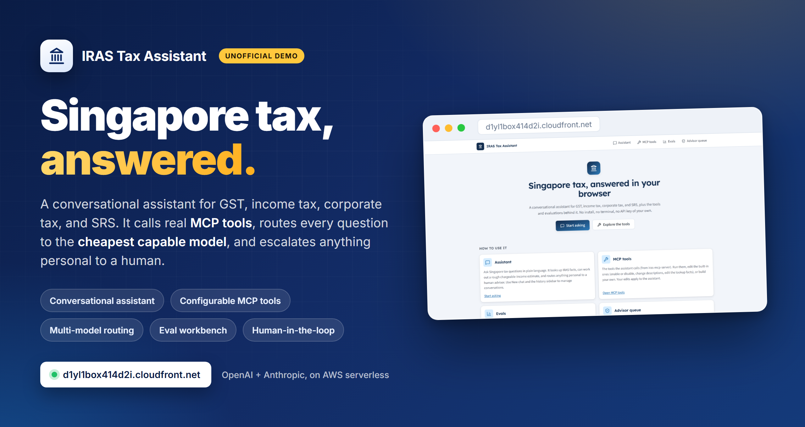
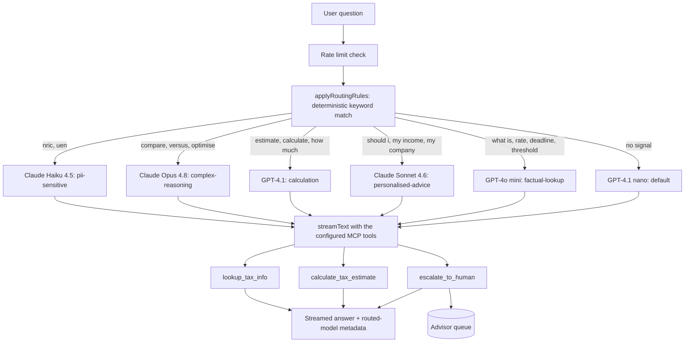
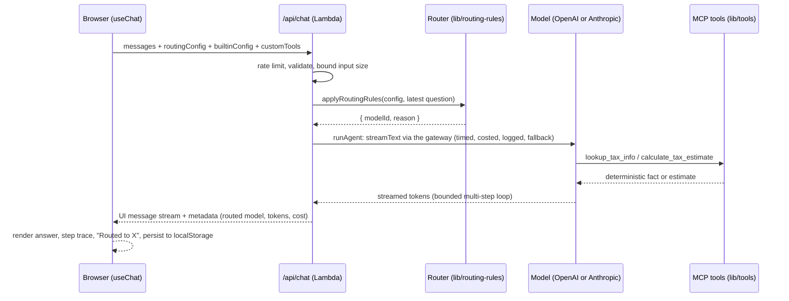
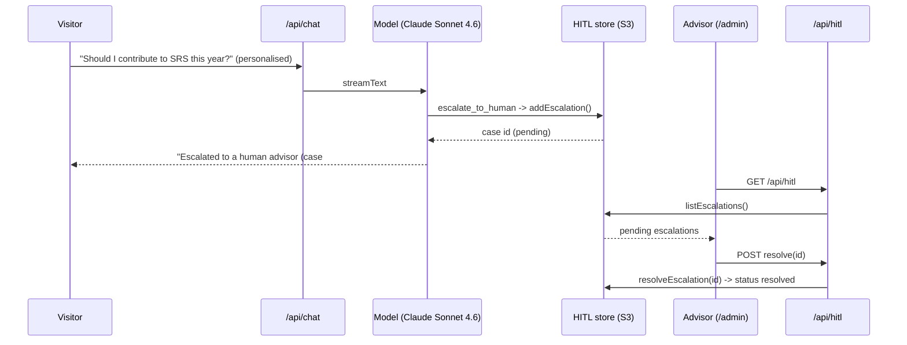
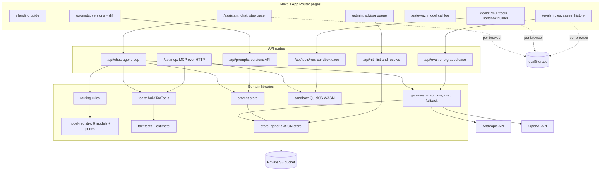
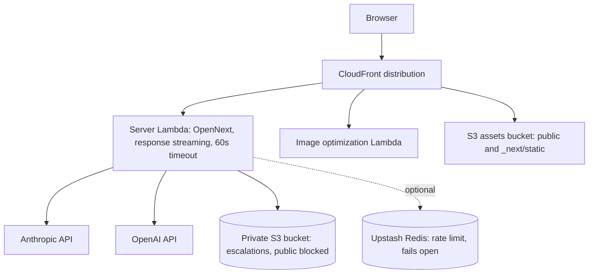
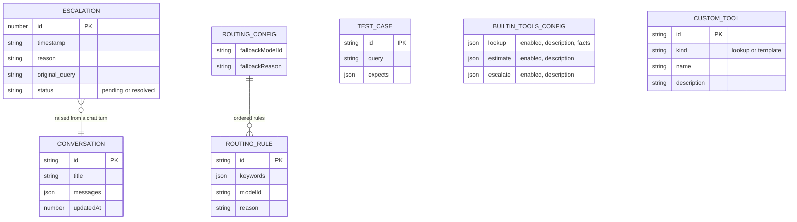
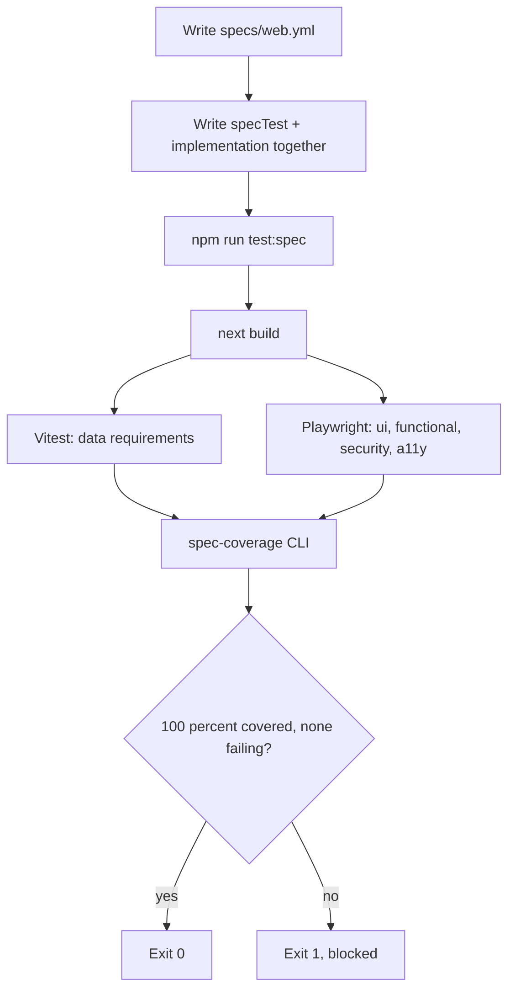

<div align="center">

# Unofficial IRAS Tax Assistant

**A conversational Singapore tax assistant that answers GST, income tax, corporate tax, and SRS questions in plain language, calls real MCP-style tools, routes every query to the cheapest capable model across OpenAI and Anthropic, and escalates anything personal to a human.**

[](https://d1yl1box414d2i.cloudfront.net) &nbsp; &nbsp; &nbsp; &nbsp; &nbsp;

<a href="https://d1yl1box414d2i.cloudfront.net"></a>

</div>

> **Unofficial demo.** This project is not affiliated with, endorsed by, or connected to the Inland Revenue Authority of Singapore (IRAS) or the Singapore government. "IRAS" is used only to describe the subject matter. It provides general information for demonstration, not personalised tax advice, and the tax figures shown are illustrative and may not reflect current rules. Always confirm with IRAS or a qualified professional.

---

## Table of contents

- [What it is](#what-it-is)
- [AI-native architecture](#ai-native-architecture)
- [Feature tour](#feature-tour)
- [Connect via MCP](#connect-via-mcp)
- [How a question flows](#how-a-question-flows)
- [Sequence: a chat turn](#sequence-a-chat-turn)
- [Sequence: human escalation](#sequence-human-escalation)
- [Logical architecture](#logical-architecture)
- [Physical architecture](#physical-architecture)
- [Deployment pipeline](#deployment-pipeline)
- [Data model](#data-model)
- [Spec-driven development](#spec-driven-development)
- [Tech stack](#tech-stack)
- [Local development](#local-development)
- [Deployment](#deployment)
- [Repository structure](#repository-structure)
- [Provenance and disclaimer](#provenance-and-disclaimer)

---

## What it is

Three command-line projects, an MCP tool server, a tax agent, and an LLM eval harness, made usable by anyone in a browser. No install, no terminal, no API key of your own.

- **Assistant.** Ask a Singapore tax question. It grounds factual answers in IRAS facts via a tool, can work out a rough chargeable-income estimate, and routes anything personal to a human advisor. Conversations have history and a New chat button, stored per browser.
- **Cheapest capable routing.** A deterministic rule engine picks a model per query from six models across OpenAI and Anthropic, so a simple lookup uses a cheap model and a complex comparison uses a premium one. Each answer shows which model handled it.
- **Configurable MCP tools.** The three built-in tools can be enabled, disabled, redescribed, and (for the lookup tool) have their facts edited. Visitors can also build their own lookup or template tools. Edits apply to the live assistant.
- **An eval workbench.** Edit the routing rules and the test cases, click Run, and watch each case route to a model and get graded (keyword or LLM-as-judge), with a per-model comparison and a persisted run history. The same suite runs in CI as a regression gate against a committed baseline.
- **A model gateway.** Every model call (chat, evals, the judge) flows through one gateway that times it, counts tokens, computes USD cost from list prices, falls back across providers on error, and logs it to the `/gateway` page.
- **Prompt management.** The system prompt is versioned: immutable versions, an activation pointer, a line diff between versions, and the live assistant resolves the active one.
- **A secure sandbox.** Visitors can write JavaScript tools that run server-side in a QuickJS WASM sandbox with hard time, memory, and output limits and no host capabilities.
- **A real MCP server.** The tax tools are exposed over Streamable HTTP at `/api/mcp` and over stdio, so Claude Code or any MCP client can call them.
- **A visible agent loop.** Multi-step replies show a numbered step trace: each tool call with its input and output, plus tokens and cost per reply.
- **Human in the loop.** Personalised questions are escalated to an advisor queue that a human resolves.

It is built on the [`elleskay/platform`](https://github.com/elleskay/platform) template: a Next.js to AWS serverless monorepo with a mandatory spec-driven test gate.

---

## AI-native architecture

Seven artifacts of AI-native engineering, each a working feature in this app:

| Artifact | What it does here | Where |
|---|---|---|
| Model gateway | Wraps every model call: latency, tokens, USD cost from registry prices, cross-provider fallback, persisted logs | `lib/gateway.ts`, `/gateway` |
| Prompt management | Immutable prompt versions, activation pointer, line diff, live resolution with compiled-in fallback | `lib/prompt-store.ts`, `/prompts` |
| Evaluation harness | Keyword and LLM-as-judge graders, persisted run history with trend, prompt-version targeting, CLI baseline gate | `lib/graders.ts`, `scripts/run-eval.ts`, `/evals` |
| AI-assisted code review | Claude reviews every PR against this repo's conventions; an eval gate blocks prompt regressions | `.github/workflows/ai-review.yml`, `eval-gate.yml` |
| Secure sandbox runtime | User JavaScript in QuickJS WASM: 1s deadline, 32MB cap, 8KB output cap, zero host globals | `lib/sandbox.ts`, `/api/tools/run` |
| Internal MCP server | The four tax tools over Streamable HTTP and stdio, bearer-gated escalation | `app/api/[transport]/route.ts`, `mcp/stdio.ts` |
| Agent architecture | Bounded multi-step tool loop with a visible numbered step trace, tokens, and cost per reply | `lib/run-agent.ts`, `/assistant` |

CI never calls an LLM from tests. The live-LLM workflows (AI review, eval gate) run only when `ANTHROPIC_API_KEY` is present and skip cleanly otherwise, so forks stay green.

---

## Feature tour

### Landing: a guided entry point

A plain-language guide to each part of the app, with example questions that open the assistant and ask them.


### Assistant: tools and per-query model routing

A factual question calls the `lookup_tax_info` tool and is answered by the cheapest model the rules pick (here, GPT-4o mini). The chip under each answer reports the routed model.


### MCP tools: configurable, and they drive the assistant

Enable or disable each built-in tool, edit its description, and edit the lookup tool's facts. Build your own tools too. Everything is sent with each chat request, so edits change the live assistant.


### Evals: configurable rules, runnable test cases, model comparison

Edit the routing rules (each model shows its approximate price) and the test cases, pick a grader (keyword or LLM judge) and a prompt version, then Run. Each case routes to a model and is graded; results compare models side by side, and every run lands in a persisted history with a pass-rate trend.


### Gateway: every model call, observed

`/gateway` lists recent model calls from the gateway log: model, latency, input and output tokens, USD cost, and whether the cross-provider fallback fired. Chat answers carry the same numbers in their metadata chip.

### Prompts: versioned system prompt

`/prompts` lists the system prompt's immutable versions with the active one marked, shows a line diff between any version and its predecessor, and lets you save and activate new versions. The assistant resolves the active version on the next turn.

### Advisor queue: human in the loop

Escalated questions land here for a human to review and resolve.


---

## Connect via MCP

The tax tools are a real MCP server, not just in-process `tool()` definitions. Two transports, same tools (`lookup_tax_info`, `calculate_tax_estimate`, `escalate_to_human`, `run_javascript`):

**Streamable HTTP** at `/api/mcp`. Add to `.mcp.json` in any MCP client:

```json
{
  "mcpServers": {
    "iras-tax": {
      "type": "http",
      "url": "https://d1yl1box414d2i.cloudfront.net/api/mcp"
    }
  }
}
```

**stdio** for local use (for example Claude Code):

```json
{
  "mcpServers": {
    "iras-tax": {
      "command": "npx",
      "args": ["tsx", "mcp/stdio.ts"],
      "cwd": "apps/web"
    }
  }
}
```

Lookup and calculation are public (rate limited). When the optional `MCP_API_KEY` env var is set, `escalate_to_human` requires `Authorization: Bearer <key>` (constant-time compare); unset means open. The Tools page shows the endpoint and a copyable config.

---

## How a question flows

The router is the cheap part: deterministic keyword rules, no extra model call. The model is only called to answer.



---

## Sequence: a chat turn



---

## Sequence: human escalation



---

## Logical architecture

Pages, API routes, the pure domain libraries they call, and the external providers and stores. The router and tools are plain deterministic code; the models are the only network dependency for answering.



---

## Physical architecture

One CloudFront distribution fronts a streaming server Lambda (built by OpenNext), an image Lambda, and an S3 assets bucket. The server Lambda calls the model providers and a private S3 bucket for the escalation queue. There is no relational database.



---

## Deployment pipeline

`deploy.yml` runs on push to main. It assumes an AWS role over OIDC (no stored keys), bakes the model keys in at synth, builds with OpenNext, runs CDK deploy, and the smoke test probes the live URL.


Secrets baked at synth and forwarded in the deploy step: `ANTHROPIC_API_KEY`, `OPENAI_API_KEY`, `ANTHROPIC_MODEL`, and the optional `MCP_API_KEY` (gates the MCP escalation tool; unset means open). The HITL bucket name is a CDK token resolved at deploy time.

---

## Data model

No relational database. Two stores, chosen for what each needs:

- **Server-side state** lives in one private S3 bucket through a generic JSON store (`lib/store.ts`): one object per record, prefix per entity, reverse-chronological ids so listing is newest-first without a sort key. Prefixes: `escalations/` (advisor queue), `gateway/` (model call logs), `prompts/` (versioned system prompt), `eval-runs/` (run history). Concurrent Lambda writes never race on a shared file. Locally and in tests, the same store writes JSON files instead.
- **Everything else is per browser** in `localStorage`: conversation history, the routing config, the eval test cases, the built-in tool config, and any custom tools. Nothing personal is stored server-side beyond an escalation the user explicitly triggers.



Server-persisted (S3): `ESCALATION`, plus gateway call logs, prompt versions, and eval runs under their own prefixes. Client-persisted (localStorage): `CONVERSATION`, `ROUTING_CONFIG`, `ROUTING_RULE`, `TEST_CASE`, `BUILTIN_TOOLS_CONFIG`, `CUSTOM_TOOL`.

---

## Spec-driven development

Every feature is written from a spec first. `specs/web.yml` lists each requirement with a unique ID, a category, a severity, and given/when/then criteria. Implementation and `specTest()` land in the same change. The gate (`npm run test:spec`) builds, runs the tests, and refuses to pass below 100 percent requirement coverage. `data` requirements run on Vitest (pure functions); `ui`, `functional`, `security`, and `a11y` run on Playwright. The LLM is non-deterministic, so chat and eval e2e stub the API with fixed fixtures and assert against them.



The 52 requirements currently covered:

<details>
<summary><strong>Show all 52 requirements</strong></summary>

| ID | Category | Requirement |
|---|---|---|
| IRAS-TAX-001 | data | Chargeable income is gross income minus deductions, floored at zero |
| IRAS-TAX-002 | data | Tax lookup returns the known fact for a supported topic |
| IRAS-HITL-001 | data | Escalation store supports create, list, and resolve |
| IRAS-ROUTER-001 | data | The deterministic routing rules pick the right model per query |
| IRAS-TOOLS-004 | data | Built-in tools respect their configuration (enable/disable, facts) |
| IRAS-RATELIMIT-001 | data | Rate limiting fails open when Upstash is not configured |
| IRAS-STORE-001 | data | Generic JSON store round-trips values and lists newest-first |
| IRAS-GATEWAY-001 | data | The gateway records model, latency, and token usage per call |
| IRAS-GATEWAY-002 | data | Gateway cost is computed from registry prices (generate and stream) |
| IRAS-GATEWAY-003 | data | A provider error falls back to the alternate provider and is flagged |
| IRAS-EVAL-004 | data | Eval runs persist and list newest-first |
| IRAS-EVAL-005 | data | The LLM judge grades to a structured verdict and fails closed |
| IRAS-EVAL-007 | data | Baseline comparison flags regressions beyond the tolerance |
| IRAS-EVAL-008 | data | A persisted run records the prompt version and grader it targeted |
| IRAS-PROMPT-001 | data | Prompt store keeps immutable versions behind an activation pointer |
| IRAS-PROMPT-002 | data | System prompt resolves from the active version, falls back to default |
| IRAS-SANDBOX-001 | data | Sandboxed code tools run user JavaScript and return a JSON result |
| IRAS-SANDBOX-004 | data | Sandbox output is capped with a truncation marker |
| IRAS-AGENT-001 | data | The agent loop chains tools across steps until the answer |
| IRAS-CHAT-001 | ui | Home page (assistant) renders the chat interface |
| IRAS-CHAT-003 | ui | A general-information disclaimer is always visible |
| IRAS-LANDING-001 | ui | Landing page guides the visitor and links into the assistant |
| IRAS-TOOLS-001 | ui | Tools page lists the MCP server tools |
| IRAS-TOOLS-006 | ui | The Tools page shows how to connect via MCP |
| IRAS-EVAL-001 | ui | Evals page shows configurable routing rules and test cases |
| IRAS-GATEWAY-004 | ui | The gateway page lists recent model calls |
| IRAS-PROMPT-003 | ui | The prompts page lists versions and shows a line diff between them |
| IRAS-AGENT-002 | ui | Assistant replies show a numbered step trace of tool use |
| IRAS-CHAT-002 | functional | Sending a message shows the user message and the assistant reply |
| IRAS-CHAT-004 | functional | New chat clears the conversation and history keeps the previous one |
| IRAS-CHAT-005 | functional | A question deep link (`/assistant?q=`) asks it automatically |
| IRAS-NAV-001 | functional | Primary navigation links to every page |
| IRAS-TOOLS-002 | functional | A visitor can run the lookup tool and see a result |
| IRAS-TOOLS-003 | functional | A visitor can create a custom tool and run it |
| IRAS-TOOLS-005 | functional | A visitor can build a sandboxed code tool and run it end to end |
| IRAS-EVAL-002 | functional | The route preview shows where a query routes |
| IRAS-EVAL-003 | functional | Running the test cases populates the result stats |
| IRAS-EVAL-006 | functional | Run history shows past runs with a pass-rate trend |
| IRAS-PROMPT-004 | functional | Creating and activating a prompt version works end to end |
| IRAS-HITL-002 | functional | Admin page lists pending escalations |
| IRAS-HITL-003 | functional | Resolving an escalation marks it resolved end to end |
| IRAS-MCP-001 | functional | The MCP endpoint answers a JSON-RPC initialize |
| IRAS-MCP-002 | functional | tools/list exposes the four tax tools with schemas |
| IRAS-MCP-003 | functional | Calling lookup_tax_info over MCP returns the GST threshold |
| IRAS-AGENT-003 | functional | A multi-step reply renders the full trace and the answer |
| IRAS-A11Y-001 | a11y | Page exposes a skip-to-content link and a single h1 |
| IRAS-A11Y-002 | a11y | The chat message input has an accessible label |
| IRAS-SEC-001 | security | Responses carry baseline security headers |
| IRAS-PROMPT-005 | security | The prompts write API validates input and is rate limited |
| IRAS-SANDBOX-002 | security | Runaway sandbox code is interrupted by hard time and memory limits |
| IRAS-SANDBOX-003 | security | The sandbox exposes no host capabilities |
| IRAS-MCP-004 | security | Escalation over MCP requires the API key when one is configured |

</details>

---

## Tech stack

| Layer | Choice |
|---|---|
| Framework | Next.js 16 (App Router), React 19, TypeScript strict |
| AI | Vercel AI SDK v6, `@ai-sdk/anthropic`, `@ai-sdk/openai`, `@ai-sdk/react` |
| Models | OpenAI: GPT-4.1 nano, GPT-4o mini, GPT-4.1. Anthropic: Claude Haiku 4.5, Sonnet 4.6, Opus 4.8 |
| UI | Tailwind CSS v4, shadcn/ui (Radix), AI Elements, lucide icons, IRAS colour palette |
| Routing | Deterministic keyword rules (no classifier call), configurable per browser |
| Gateway | `wrapLanguageModel` middleware: latency, tokens, cost, cross-provider fallback, persisted logs |
| Tools | Configurable `tool()` definitions plus a real MCP server (`mcp-handler`, `@modelcontextprotocol/sdk`) over Streamable HTTP and stdio |
| Sandbox | QuickJS WASM (`quickjs-emscripten-core`, singlefile sync variant): hard time, memory, and output limits |
| Evals | Keyword and LLM-as-judge graders, persisted history, CLI baseline gate in CI |
| Prompts | Versioned store with activation pointer and line diff (`diff`) |
| Persistence | One private S3 bucket via a generic JSON store (escalations, gateway logs, prompts, eval runs), browser localStorage for everything client-side |
| Rate limit | Upstash Redis, fails open when unconfigured |
| Runtime | Node 22, AWS Lambda, response streaming |
| Hosting | CloudFront, S3, Lambda via OpenNext |
| IaC | AWS CDK (TypeScript) |
| CI/CD | GitHub Actions, OIDC deploys, no stored AWS keys |
| Testing | Vitest, Playwright, the `@platform/spec-test` gate at 100 percent coverage |

---

## Local development

```bash
cd apps/web
npm install
# add apps/web/.env.local with ANTHROPIC_API_KEY and OPENAI_API_KEY
npm run dev            # http://localhost:3000

npm run test:spec      # build + vitest + playwright + 100% coverage gate
npm run eval           # run the committed eval suite against the baseline (needs ANTHROPIC_API_KEY)
npm run mcp:stdio      # serve the tax tools over MCP stdio
```

Without API keys the UI still renders; only the live model calls fail. Rate limiting and the HITL store both fall back to local-friendly defaults (fail-open limiter, JSON file queue).

---

## Deployment

Pushing to `main` deploys automatically via `deploy.yml` (OIDC, OpenNext build, CDK deploy, smoke test). The model keys are GitHub Actions secrets, forwarded into the synth step and baked into the Lambda environment. The escalation bucket is provisioned by the CDK stack (`infra/cdk/web/lib/web-stack.ts`) with all public access blocked.

```bash
# one-off, from infra/cdk/web after configuring the OIDC role and repo secrets
gh secret set ANTHROPIC_API_KEY
gh secret set OPENAI_API_KEY
git push   # deploy.yml builds, deploys, and smoke-tests the live URL
```

---

## Repository structure

```
apps/web/
  app/
    page.tsx              Landing / guide
    assistant/page.tsx    Chat: routing, step trace, history, deep links
    tools/page.tsx        Configurable tools + sandbox builder + MCP connect
    evals/page.tsx        Routing-rule + test-case workbench + run history
    gateway/page.tsx      Model call log: latency, tokens, cost, fallback
    prompts/page.tsx      Versioned system prompt with line diff
    admin/page.tsx        Advisor queue
    api/chat              The agent loop: route, tools, stream, metadata
    api/eval              Run one graded eval case on a chosen model
    api/eval/runs         Persist and list eval runs
    api/prompts           List, create, and activate prompt versions
    api/tools/run         Server-side tool execution (sandbox included)
    api/[transport]       MCP server over Streamable HTTP (/api/mcp)
    api/hitl              List and resolve escalations
  lib/
    run-agent.ts          Bounded multi-step agent loop (streamText)
    gateway.ts            Model wrapper: time, cost, log, fallback
    store.ts              Generic JSON store: S3 (prod) or file (dev)
    prompt-store.ts       Immutable prompt versions + activation pointer
    graders.ts            Keyword and LLM-as-judge grading
    sandbox.ts            QuickJS WASM sandbox with hard limits
    mcp-tools.ts          The four MCP tools + escalation auth guard
    routing-rules.ts      Deterministic router + config + storage
    model-registry.ts     Six models, tiers, approximate prices
    tools.ts / tax.ts     buildTaxTools + facts + estimate
    hitl-store.ts         Escalation store on lib/store.ts
    rate-limit.ts         Upstash limiter, fails open
  mcp/stdio.ts            MCP server over stdio (npm run mcp:stdio)
  scripts/run-eval.ts     Eval CLI: suite vs committed baseline, CI gate
  evals/                  Committed suite.json + baseline.json
  specs/web.yml           52 requirements, the source of truth
  tests/                  Vitest (data) + Playwright (ui/functional/security/a11y)
infra/cdk/web/            NextjsServerless construct + private bucket stack
.github/workflows/        deploy.yml, ai-review.yml, eval-gate.yml
```

---

## Provenance and disclaimer

Built on the [`elleskay/platform`](https://github.com/elleskay/platform) template, and showcases three command-line projects in one browser app: an MCP tax-tool server, a tax agent, and an LLM eval harness.

This is an unofficial demonstration. It is not affiliated with, endorsed by, or connected to the Inland Revenue Authority of Singapore (IRAS) or the Singapore government; the name "IRAS" is used only to describe the subject matter. It provides general information about Singapore tax, not personalised tax advice. Tax figures shown are illustrative and may not reflect current IRAS rules; always confirm with IRAS or a qualified professional.
