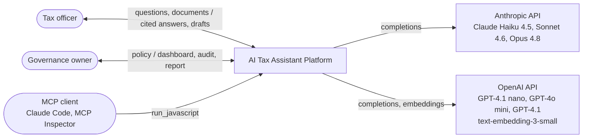
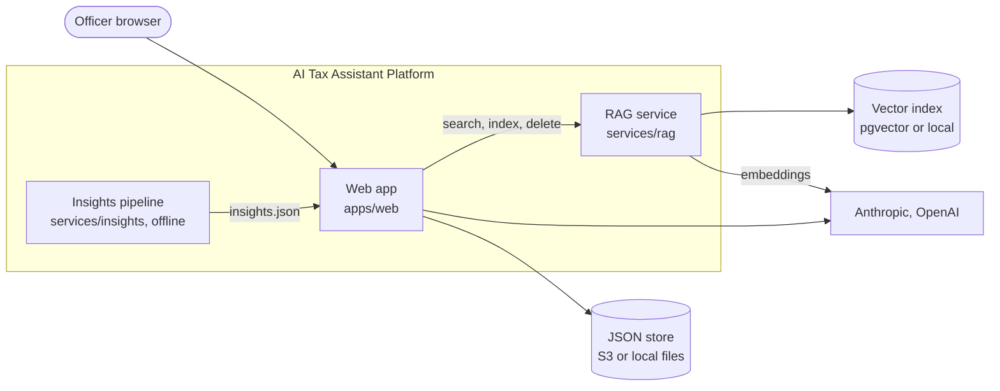
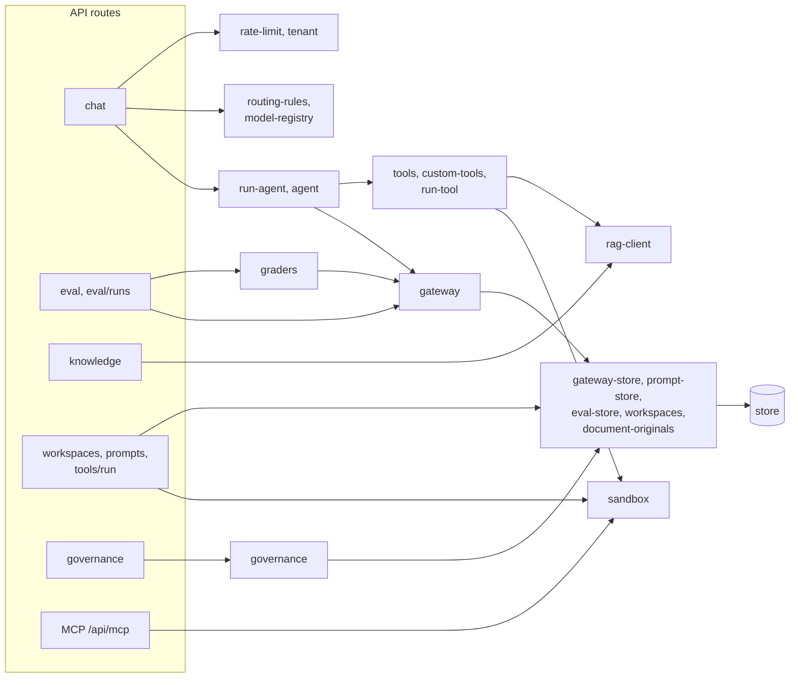
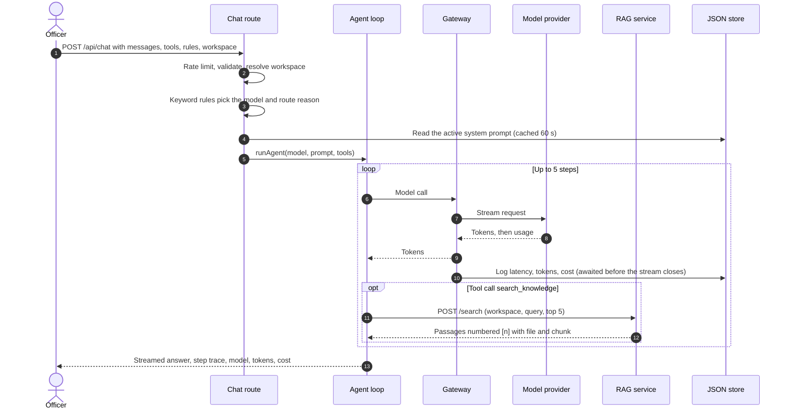
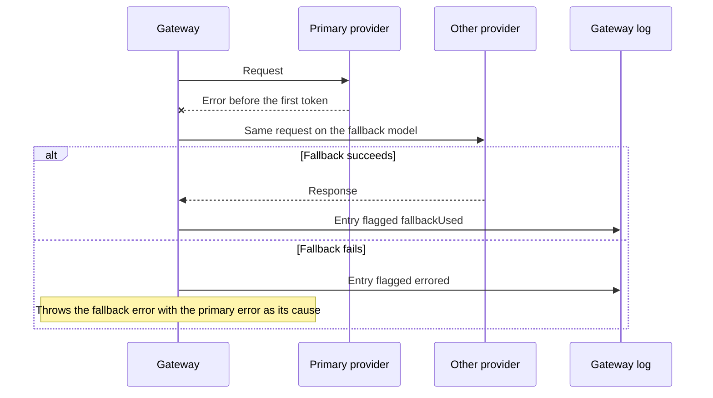
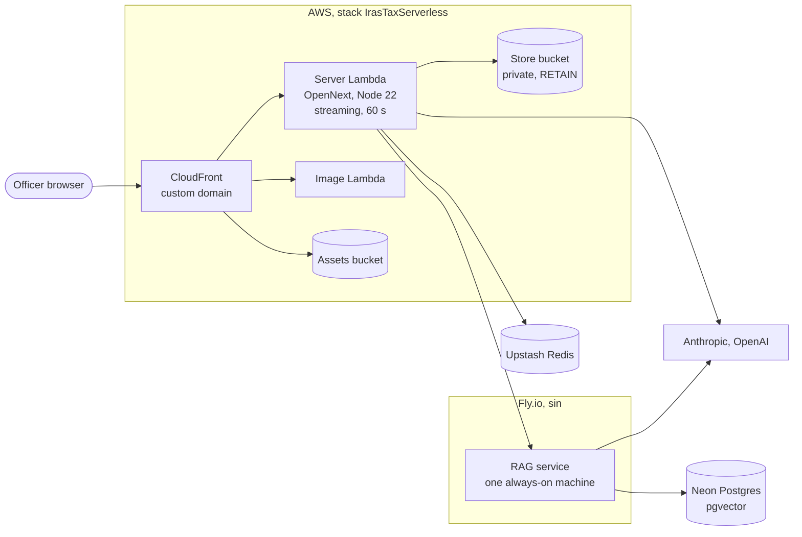
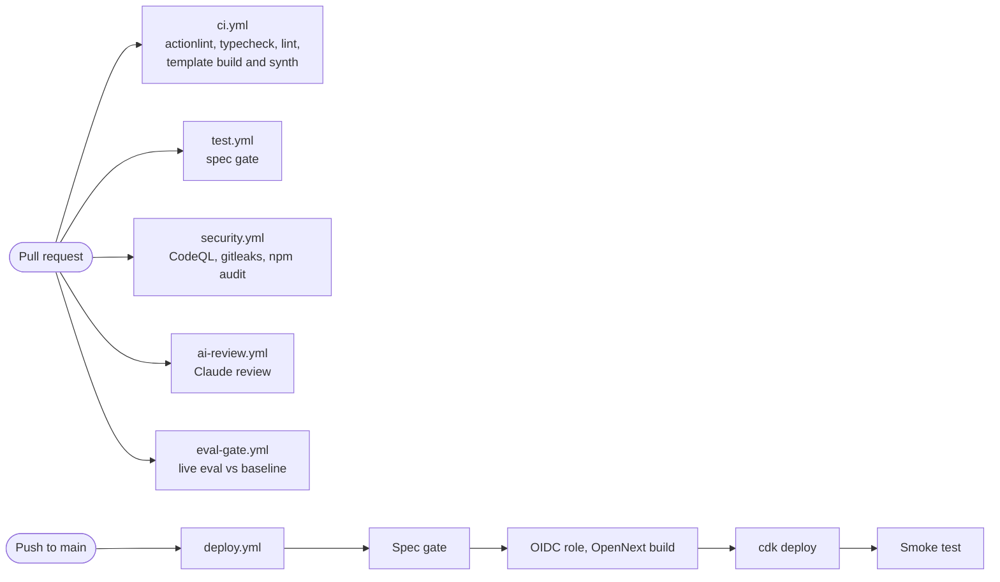

# AI Tax Assistant Platform

A multi-tenant assistant for tax officers. Each department works in its own workspace, where a document-grounded assistant answers questions with citations, drafts replies for the officer to review, and triages cases. Deterministic rules route every query across six models through one observed gateway, officer-built tools run in a WebAssembly sandbox, and a single governance policy, written as code, applies to every workspace.

> General information for demonstration, not personalised tax advice. Figures are illustrative.

This document follows the [arc42](https://arc42.org) architecture template. To run the app, go to [7.3 Local development](#73-local-development).

| Section | Section |
|---|---|
| 1. [Introduction and goals](#1-introduction-and-goals) | 7. [Deployment view](#7-deployment-view) |
| 2. [Architecture constraints](#2-architecture-constraints) | 8. [Cross-cutting concepts](#8-cross-cutting-concepts) |
| 3. [Context and scope](#3-context-and-scope) | 9. [Architecture decisions](#9-architecture-decisions) |
| 4. [Solution strategy](#4-solution-strategy) | 10. [Quality requirements](#10-quality-requirements) |
| 5. [Building block view](#5-building-block-view) | 11. [Risks and technical debt](#11-risks-and-technical-debt) |
| 6. [Runtime view](#6-runtime-view) | 12. [Glossary](#12-glossary) |

---

## 1. Introduction and goals

### 1.1 Requirements overview

| Capability | What the officer gets | Where |
|---|---|---|
| Grounded answers | Answers from the workspace's own documents, an inline `[n]` citation per fact, and a numbered step trace of the tools used | `/assistant` |
| Workspaces | One workspace per department, created self-serve; the assistant, documents, instructions, and gateway log all scope to the active one | `/workspaces` |
| Documents | Guidance uploaded, chunked, embedded, and indexed per workspace; originals stay downloadable | `/documents` |
| Cost transparency | Which of six models answered and why, with the tokens and USD cost of every reply | `/assistant`, `/gateway` |
| Custom tools | No-code lookup tables and reply templates, plus JavaScript calculators run in a sandbox, all callable by the assistant | `/tools` |
| Versioned instructions | The system prompt as immutable versions behind an activation pointer, with line diffs | `/prompts` |
| Evaluation | Test cases routed to models and graded by keyword or LLM judge, with a persisted run history and pass-rate trend | `/evals` |
| Governance | One policy for every workspace, a live dashboard, a full audit trail, and a downloadable AI risk assessment | `/governance`, `/governance/policy`, `/governance/audit` |
| Usage analytics | Training needs, documentation gaps, and process hotspots mined from (synthetic) usage | `/insights` |
| MCP | The sandbox exposed as the MCP tool `run_javascript`, over Streamable HTTP and stdio | `/api/mcp` |

Out of scope: personalised advice, taxpayer-facing use (the officer reviews and sends every draft), and authentication (the demo takes the active workspace from a cookie). The testable requirements, each with given/when/then, are in [`apps/web/specs/web.yml`](apps/web/specs/web.yml).

### 1.2 Quality goals

The defining concerns are trust, isolation, and cost, not scale.

| Priority | Goal | Meaning |
|---|---|---|
| 1 | Grounded | Answers come from the workspace's retrieved documents and cite them. Figures come from tools, not model memory. |
| 2 | Isolated | One workspace's documents, logs, and instructions never reach another, and every workspace runs under the same standard. |
| 3 | Cost-aware and observable | Each query uses the cheapest capable model, choosing it costs nothing, and every model call is timed, priced, logged, and survives a provider outage. |
| 4 | Safe | Officer-written code runs with hard time, memory, and output limits and no host access. |
| 5 | Testable | The build is deterministic despite a model in the loop: no test calls an LLM. |

### 1.3 Stakeholders

| Stakeholder | Expectations |
|---|---|
| Tax officers | Fast, cited answers; review-ready drafts; tools they can build without a developer |
| Department leads | Their own documents, instructions, and model settings, with visible per-workspace cost |
| AI governance and risk owners | One enforceable standard, an audit trail, and a risk assessment mapped to Singapore's frameworks (IMDA/PDPC Model AI Governance Framework, AI Verify) |
| Platform engineers | Spec-driven changes, reproducible CI, scale-to-zero operations |
| Taxpayers (indirect) | Correct replies and careful handling of their data; they never use the system directly |

---

## 2. Architecture constraints

| Constraint | Background |
|---|---|
| Next.js 16 (App Router), React 19, TypeScript strict, Node 22+ | Conventions of the [platform template](https://github.com/elleskay/platform) this repo is built on |
| AWS Lambda, S3, and CloudFront via OpenNext, provisioned with AWS CDK | Same template; serverless, nothing to patch, scales to zero |
| No relational database for app state | App state is a handful of flat records, and nothing should bill while idle |
| 60 s per request | The server Lambda and the CloudFront origin read timeout are raised together to 60 s, the CloudFront maximum without a quota increase. A streamed agent turn must fit. |
| Environment is baked at CDK synth | Every runtime secret is wired in both [`web-stack.ts`](infra/cdk/web/lib/web-stack.ts) and the deploy workflow's CDK step ([DEPLOY.md](docs/DEPLOY.md) #13) |
| Inlined-WASM packages stay external | Turbopack cannot bundle the QuickJS singlefile build, so it and `shiki` ship as `serverExternalPackages` ([DEPLOY.md](docs/DEPLOY.md) #15) |
| Build on Linux, macOS, or WSL | The OpenNext image function cannot install its dependencies on Windows |
| Spec-first delivery | Behavior needs a requirement in the spec and a `specTest()` before it ships; the deploy is blocked unless every requirement has a passing test ([TESTING.md](docs/TESTING.md)) |
| No LLM calls in tests | Live model calls in CI are confined to the PR AI review and the path-filtered eval gate, and both skip without a key |
| Conventions | Conventional Commits, Zod at every API boundary, no secrets in the repo, no em dashes or emojis in code, docs, UI, or answers |

---

## 3. Context and scope

### 3.1 Business context


```mermaid
flowchart LR
  Officer(["Tax officer"])
  Gov(["Governance owner"])
  MCPC(["MCP client<br/>Claude Code, MCP Inspector"])
  P["AI Tax Assistant Platform"]
  Anth["Anthropic API<br/>Claude Haiku 4.5, Sonnet 4.6, Opus 4.8"]
  OAI["OpenAI API<br/>GPT-4.1 nano, GPT-4o mini, GPT-4.1<br/>text-embedding-3-small"]
  Officer <-->|"questions, documents / cited answers, drafts"| P
  Gov <-->|"policy / dashboard, audit, report"| P
  MCPC -->|"run_javascript"| P
  P -->|"completions"| Anth
  P -->|"completions, embeddings"| OAI
```

| Partner | Exchanges with the platform |
|---|---|
| Tax officer | Sends questions, documents, custom tools, instructions, and eval cases. Receives streamed, cited answers and drafts, with the model, tokens, and cost. The platform never sends anything to a taxpayer. |
| Governance owner | Edits the platform policy; reads the dashboard, audit trail, and risk assessment |
| MCP client | Calls `run_javascript` and gets the sandbox result |
| Anthropic | Serves the three Claude models |
| OpenAI | Serves the three GPT models, plus the embeddings the RAG service uses |

### 3.2 Technical context

| Interface | Channel | Notes |
|---|---|---|
| Browser to web app | HTTPS through CloudFront | JSON APIs and the AI SDK UI message stream; the `workspace` cookie selects the tenant |
| MCP client to web app | MCP Streamable HTTP at `/api/mcp`, or stdio | Stateless, SSE disabled; stdio via `npm run mcp:stdio` |
| Web app to model providers | HTTPS via `@ai-sdk/anthropic` and `@ai-sdk/openai` | API keys from the Lambda environment |
| Web app to RAG service | HTTPS JSON with a bearer token | 8 s timeout (30 s to index); replies are Zod-validated; an unset `RAG_SERVICE_URL` disables retrieval |
| RAG service to Neon | Postgres over TLS | pgvector, one table per workspace |
| RAG service to OpenAI | HTTPS | `text-embedding-3-small`, 1536 dimensions |
| Web app to S3 | AWS SDK, Lambda execution role | The JSON store bucket |
| Web app to Upstash | Redis REST | Rate limits; optional, fails open |
| GitHub Actions to AWS | OIDC role assumption | CDK deploy with no stored AWS keys |

---

## 4. Solution strategy

| Goal | Approach | See |
|---|---|---|
| Grounded | A dedicated RAG service holds one vector index per workspace. The agent's only built-in tool, `search_knowledge`, returns numbered passages, and the system prompt requires an `[n]` after every fact taken from a document. | [ADR-4](#adr-4-a-dedicated-rag-service) |
| Isolated | One app. Every store key and every vector table carries the workspace slug, validated at the store boundary. | [8.1](#81-multi-tenancy), [ADR-3](#adr-3-one-app-keyed-per-workspace) |
| Cost-aware and observable | Keyword rules pick one of six models with no extra model call. One gateway middleware times, prices, logs, and falls back on every call. | [ADR-1](#adr-1-route-by-keyword-rules-not-a-classifier), [ADR-2](#adr-2-one-gateway-as-model-middleware) |
| Safe | Officer code runs in QuickJS compiled to WebAssembly, in a fresh runtime per call. | [ADR-5](#adr-5-quickjs-in-webassembly-for-officer-code) |
| Testable | The agent loop is a plain function with injectable mock models, the chat e2e stubs the stream, and a spec gate blocks the deploy. | [ADR-8](#adr-8-deterministic-tests) |
| Near-zero idle cost | App state is one S3 object per record, with no database. The web tier scales to zero. | [ADR-6](#adr-6-one-s3-object-per-record-no-database) |
| One standard | Governance is a declarative policy merged with editable overrides and surfaced on a dashboard, an audit trail, and a report. | [8.4](#84-governance-as-code), [ADR-7](#adr-7-governance-as-code) |

| Layer | Technology |
|---|---|
| Web | Next.js 16 App Router, React 19, TypeScript strict, Tailwind CSS 4, shadcn/ui, Streamdown |
| AI | Vercel AI SDK v6 (`streamText`, `wrapLanguageModel`, `generateObject`) with the Anthropic and OpenAI providers |
| Models | GPT-4.1 nano, GPT-4o mini, GPT-4.1, Claude Haiku 4.5, Claude Sonnet 4.6, Claude Opus 4.8 |
| Retrieval | Python 3.12, FastAPI, LlamaIndex, OpenAI `text-embedding-3-small`, pgvector on Neon (a local file store in dev) |
| Sandbox | QuickJS via `quickjs-emscripten`, compiled to WebAssembly |
| MCP | `@modelcontextprotocol/sdk`, `mcp-handler` |
| Persistence | JSON store over S3 (local files in dev), browser localStorage |
| Rate limiting | Upstash Redis, sliding window |
| Analytics | Python and numpy; scikit-learn and sentence-transformers when installed |
| Infrastructure | AWS Lambda, S3, CloudFront via OpenNext and AWS CDK; Fly.io for the RAG service |
| Quality | Vitest, Playwright, `@platform/spec-test`, CodeQL, gitleaks, Dependabot |

---

## 5. Building block view

### 5.1 Level 1: the system


```mermaid
flowchart LR
  Officer(["Officer browser"])
  subgraph platform["AI Tax Assistant Platform"]
    Web["Web app<br/>apps/web"]
    RAG["RAG service<br/>services/rag"]
    Ins["Insights pipeline<br/>services/insights, offline"]
  end
  Store[("JSON store<br/>S3 or local files")]
  Vec[("Vector index<br/>pgvector or local")]
  LLM["Anthropic, OpenAI"]
  Officer --> Web
  Web -- "search, index, delete" --> RAG
  RAG --> Vec
  RAG -- "embeddings" --> LLM
  Web --> Store
  Web --> LLM
  Ins -- "insights.json" --> Web
```

| Building block | Path | Responsibility |
|---|---|---|
| Web app | [`apps/web`](apps/web) | Every page and API route: chat, workspaces, documents, tools, instructions, evals, governance, MCP |
| RAG service | [`services/rag`](services/rag) | Chunks, embeds, indexes, searches, lists, and deletes documents per workspace |
| Insights pipeline | [`services/insights`](services/insights) | Offline job: synthetic usage, embeddings, KMeans clusters, then the committed `apps/web/public/insights.json` |
| Spec gate | [`packages/spec-test`](packages/spec-test) | `specTest()` wrappers for Vitest and Playwright, the coverage CLI, and an ESLint rule that rejects assertion-free tests |
| Infrastructure | [`infra/cdk/web`](infra/cdk/web) | The `IrasTaxServerless` stack: the reusable `NextjsServerless` construct plus the private store bucket |
| Platform layer | `apps/_template`, `apps/_demo`, `infra/cdk/_template`, `infra/cdk/_setup`, `infra/iam` | The template layer this repo was cloned from; CI builds and synths it as a self-test |

### 5.2 Level 2: the web app


```mermaid
flowchart LR
  subgraph api["API routes"]
    Chat["chat"]
    Eval["eval, eval/runs"]
    Know["knowledge"]
    WsApi["workspaces, prompts,<br/>tools/run"]
    GovApi["governance"]
    Mcp["MCP /api/mcp"]
  end
  Guard["rate-limit, tenant"]
  Router["routing-rules,<br/>model-registry"]
  Agent["run-agent, agent"]
  Tools["tools, custom-tools,<br/>run-tool"]
  SB["sandbox"]
  GW["gateway"]
  RC["rag-client"]
  Gr["graders"]
  Gov["governance"]
  Stores["gateway-store, prompt-store,<br/>eval-store, workspaces,<br/>document-originals"]
  JS[("store")]
  Chat --> Guard
  Chat --> Router
  Chat --> Agent
  Agent --> Tools
  Agent --> GW
  Tools --> RC
  Tools --> SB
  Mcp --> SB
  Eval --> Gr
  Eval --> GW
  Gr --> GW
  Know --> RC
  WsApi --> Stores
  WsApi --> SB
  GovApi --> Gov
  Gov --> Stores
  GW --> Stores
  Stores --> JS
```

| Module | Files | Responsibility |
|---|---|---|
| Chat route | `app/api/chat/route.ts` | Rate limit, validate, resolve the workspace, route, merge tools, stream the answer with model and cost metadata |
| Agent loop | `lib/run-agent.ts`, `lib/agent.ts` | `streamText` with at most 5 steps, temperature 0, and 800 output tokens per model call; resolves the workspace's active system prompt (60 s cache, compiled-in fallback) |
| Router | `lib/routing-rules.ts`, `lib/model-registry.ts`, `lib/model-router.ts` | First matching keyword rule wins; the registry lists six models with tier and list prices |
| Gateway | `lib/gateway.ts`, `lib/gateway-store.ts` | Middleware on every registry model: latency, tokens, USD cost, one cross-provider retry, an awaited log entry per workspace |
| Tools | `lib/tools.ts`, `lib/custom-tools.ts`, `lib/run-tool.ts`, `lib/tool-templates.ts` | `search_knowledge` when RAG is configured, plus officer lookup, template, and code tools (up to 15, Zod-validated) |
| Sandbox | `lib/sandbox.ts` | A QuickJS runtime per call with hard limits |
| RAG client | `lib/rag-client.ts` | Calls the RAG service, validates replies, and degrades to empty results |
| Stores | `lib/store.ts` and one module per record type | Workspace-keyed JSON store over S3 or local files |
| Tenancy | `lib/tenant.ts`, `lib/workspace-cookie.ts` | Resolves the workspace from header, cookie, or default, and validates the slug |
| Evals | `app/api/eval`, `lib/graders.ts`, `lib/eval-baseline.ts`, `scripts/run-eval.ts` | Keyword and judge graders, run history, the CLI regression gate |
| Governance | `lib/governance.ts`, `app/api/governance` | Policy and overrides, stats, audit trail, risk register, report |
| MCP server | `lib/mcp-tools.ts`, `app/api/[transport]/route.ts`, `mcp/stdio.ts` | `run_javascript` over Streamable HTTP and stdio |
| Rate limiting | `lib/rate-limit.ts` | Upstash sliding window per client IP; fails open |

### 5.3 Interfaces

All routes are Node.js route handlers that validate input with Zod. Limits are per client IP per minute and apply only when Upstash is configured.

| Endpoint | Purpose | Limit |
|---|---|---|
| `POST /api/chat` | Stream an answer. Body: `{ messages, customTools?, routingConfig?, workspace? }` | 20 |
| `GET /api/knowledge` | The workspace's documents and RAG status; `?q=` searches | 10 (search) |
| `POST`, `DELETE /api/knowledge` | Index up to 50 documents; delete one | 10 |
| `GET /api/knowledge/download` | A document's original text | none |
| `GET`, `POST`, `PATCH`, `DELETE /api/workspaces` | List, create, tune, delete (seeded workspaces are protected) | 20 (writes) |
| `GET`, `POST`, `PUT /api/prompts` | List versions, append a version, move the active pointer | 20 (writes) |
| `POST /api/tools/run` | Run one custom tool server-side | 30 |
| `POST /api/eval` | Answer and grade one test case | 15 |
| `GET`, `POST /api/eval/runs` | Run history; persist a run (totals computed server-side) | 20 (writes) |
| `GET`, `PUT /api/governance/policy` | Effective policy; replace the overrides | 20 (writes) |
| `GET /api/governance/report` | AI risk assessment as Markdown | none |
| `GET`, `POST`, `DELETE /api/mcp` | MCP endpoint exposing `run_javascript` | 60 |

The RAG service contract (`POST /index`, `POST /search`, `DELETE /documents`, `GET /workspaces/{workspace}/documents`, `GET /health`) is in [`services/rag/README.md`](services/rag/README.md).

---

## 6. Runtime view

### 6.1 An officer asks a question


```mermaid
sequenceDiagram
  autonumber
  actor O as Officer
  participant C as Chat route
  participant A as Agent loop
  participant G as Gateway
  participant M as Model provider
  participant R as RAG service
  participant S as JSON store
  O->>C: POST /api/chat with messages, tools, rules, workspace
  C->>C: Rate limit, validate, resolve workspace
  C->>C: Keyword rules pick the model and route reason
  C->>S: Read the active system prompt (cached 60 s)
  C->>A: runAgent(model, prompt, tools)
  loop Up to 5 steps
    A->>G: Model call
    G->>M: Stream request
    M-->>G: Tokens, then usage
    G-->>A: Tokens
    G->>S: Log latency, tokens, cost (awaited before the stream closes)
    opt Tool call search_knowledge
      A->>R: POST /search (workspace, query, top 5)
      R-->>A: Passages numbered [n] with file and chunk
    end
  end
  A-->>O: Streamed answer, step trace, model, tokens, cost
```

The route rejects more than 30 messages or a latest message over 4,000 characters. Citations keep counting across searches in one turn, so two searches never both emit `[1]`.

### 6.2 A model provider fails


```mermaid
sequenceDiagram
  participant G as Gateway
  participant P as Primary provider
  participant F as Other provider
  participant S as Gateway log
  G->>P: Request
  P--xG: Error before the first token
  G->>F: Same request on the fallback model
  alt Fallback succeeds
    F-->>G: Response
    G->>S: Entry flagged fallbackUsed
  else Fallback fails
    G->>S: Entry flagged errored
    Note over G: Throws the fallback error with the primary error as its cause
  end
```

Claude models fall back to GPT-4o mini and GPT models to Claude Haiku 4.5. A failure after streaming has started is not retried. A client that disconnects mid-stream is still logged (flagged `errored`), because the provider already billed the call.

### 6.3 An officer-built code tool runs

1. The chat route turns each validated custom tool into an AI SDK tool with a Zod input schema.
2. When the model calls a code tool, `executeCustomTool` hands the code and input to `runSandboxed`.
3. The sandbox creates a fresh QuickJS runtime and context with a 32 MB memory limit, a 512 KB stack, and an interrupt at 1 s, then evaluates the code followed by `JSON.stringify(run(JSON.parse(input)))`. The input crosses as a JSON string literal, so no host reference enters the sandbox.
4. The result is parsed and capped at 8,192 characters with a truncation marker. An error returns `Sandbox error: ...` to the model instead of failing the turn.
5. The runtime and context are disposed in `finally`. The WASM module itself loads once per process.

### 6.4 A document is uploaded

1. The Documents page posts `{ documents }` to `/api/knowledge`: up to 50 documents of 200,000 characters each, with `doc_id` reduced to a key-safe charset.
2. The RAG service validates the workspace, deletes any chunks with the same `doc_id` (upsert), splits the text into 96-token chunks with a 16-token overlap, embeds them, and inserts them into `data_rag_<workspace>`. Each chunk carries `doc_id`, `filename`, and `location` for citations. Writes are serialised per workspace; searches take no lock.
3. The web app stores the original text under `doc-originals/<workspace>/<doc_id>.json`, because overlapping chunks cannot rebuild the file for download.

### 6.5 A prompt change is evaluated

1. The eval workbench sends each test case to `POST /api/eval` with a model, a grader, and optionally a stored prompt version to try before activating it.
2. The route runs the same loop bounds as chat through the gateway (route `eval`), always against the default workspace's prompt, so results do not depend on the selected workspace.
3. Keyword grading checks each expected string. Judge grading asks Claude Haiku 4.5 for a structured verdict (pass, score, rationale) and fails closed if the verdict is missing or malformed.
4. The workbench saves the run to `/api/eval/runs`, which recomputes the totals server-side. The dashboard compares the latest pass rate with the policy's eval gate (80% by default).
5. On pull requests that touch agent code, the eval gate workflow runs [`evals/suite.json`](apps/web/evals/suite.json) against [`evals/baseline.json`](apps/web/evals/baseline.json) and fails when the pass rate drops more than 10 points.

---

## 7. Deployment view

### 7.1 Production


```mermaid
flowchart LR
  U(["Officer browser"])
  subgraph aws["AWS, stack IrasTaxServerless"]
    CF["CloudFront<br/>custom domain"]
    SF["Server Lambda<br/>OpenNext, Node 22<br/>streaming, 60 s"]
    IF["Image Lambda"]
    AB[("Assets bucket")]
    SB[("Store bucket<br/>private, RETAIN")]
  end
  subgraph fly["Fly.io, sin"]
    RAG["RAG service<br/>one always-on machine"]
  end
  Neon[("Neon Postgres<br/>pgvector")]
  UP[("Upstash Redis")]
  LLM["Anthropic, OpenAI"]
  U --> CF
  CF --> SF
  CF --> IF
  CF --> AB
  SF --> SB
  SF --> UP
  SF --> LLM
  SF --> RAG
  RAG --> Neon
  RAG --> LLM
```

| Node | Runs | Notes |
|---|---|---|
| CloudFront | Custom domain from `CUSTOM_DOMAIN_NAME` and `CERTIFICATE_ARN` at synth (ACM certificate in us-east-1, DNS by CNAME) | Server responses are not cached; static paths go to S3; price class 200 |
| Server Lambda | The OpenNext server bundle | 1024 MB, response-streaming Function URL, 60 s timeout, environment baked at synth |
| Image Lambda | OpenNext image optimisation | |
| Assets bucket | `/_next/static` and every `public/` file, including `insights.json` and `robots.txt` | Routed by the construct at synth |
| Store bucket | The JSON store | Blocks public access, SSE-S3, TLS only, `RETAIN` because it is the app's only database |
| RAG service | `python:3.12-slim` image, uvicorn, non-root user | Health check on `/health`; one machine kept warm (no scale-to-zero); shared-cpu-1x, 512 MB |
| Neon | Postgres with pgvector | One table per workspace, TLS required |
| Upstash | Redis REST | Optional; without it the public API has no rate limits |

The AWS region defaults to `ap-southeast-1`. The RAG service deploys separately with `fly deploy` from `services/rag` ([guide](services/rag/README.md)).

### 7.2 Delivery pipeline


```mermaid
flowchart LR
  PR(["Pull request"])
  Push(["Push to main"])
  CI["ci.yml<br/>actionlint, typecheck, lint,<br/>template build and synth"]
  Test["test.yml<br/>spec gate"]
  Sec["security.yml<br/>CodeQL, gitleaks, npm audit"]
  Rev["ai-review.yml<br/>Claude review"]
  Evl["eval-gate.yml<br/>live eval vs baseline"]
  Dep["deploy.yml"]
  Gate["Spec gate"]
  Build["OIDC role, OpenNext build"]
  Cdk["cdk deploy"]
  Smoke["Smoke test"]
  PR --> CI
  PR --> Test
  PR --> Sec
  PR --> Rev
  PR --> Evl
  Push --> Dep --> Gate --> Build --> Cdk --> Smoke
```

- **Spec gate** (`test.yml`): typecheck, lint, build, Vitest, Playwright, then the coverage gate. The deploy reuses it, so a red gate blocks the release.
- **AI review and eval gate**: the only workflows that call a model. Both skip without `ANTHROPIC_API_KEY`; the review skips docs-only changes, and the eval gate runs only when agent, prompt, tool, gateway, or eval files change.
- **Deploy** (`deploy.yml`): skips cleanly until `AWS_DEPLOY_ROLE_ARN` is set, ignores docs-only pushes, assumes the deploy role through OIDC, builds with OpenNext, runs `cdk deploy`, then [`verify-deploy.sh`](scripts/verify-deploy.sh) checks security headers, CSS delivery, and that `/`, `/assistant`, `/documents`, and `/governance` render.

First-time setup of AWS, GitHub, and secrets: `npm run setup`, [SETUP.md](docs/SETUP.md), and [DEPLOY.md](docs/DEPLOY.md).

### 7.3 Local development

```bash
npm install                                    # repo root; also builds @platform/spec-test
cp apps/web/.env.example apps/web/.env.local   # every variable is optional
cd apps/web && npm run dev                     # http://localhost:3000
```

Each integration no-ops when its variable is unset: without `RAG_SERVICE_URL` retrieval is off, without `STORE_BUCKET` the store writes JSON files to the working directory, and without Upstash keys there are no rate limits. Chat needs at least one of `ANTHROPIC_API_KEY` or `OPENAI_API_KEY`; the gateway's cross-provider fallback covers routes to the other provider.

For retrieval, run the RAG service alongside, set `RAG_SERVICE_URL=http://127.0.0.1:8000` in `apps/web/.env.local`, and upload `services/rag/seed/<workspace>/` from the Documents page:

```bash
cd services/rag
pip install -r requirements.txt
RAG_FAKE_EMBEDDINGS=1 uvicorn app.main:app --port 8000   # offline; set OPENAI_API_KEY for real embeddings
```

Tests:

```bash
cd apps/web && npm run test:spec                               # build, unit, e2e, coverage gate
cd services/rag && pip install -r requirements-dev.txt && pytest   # offline
```

---

## 8. Cross-cutting concepts

### 8.1 Multi-tenancy

- A workspace is one department or tax type, identified by a slug matching `^[a-z0-9-]{1,40}$`. Two are seeded (`individual-income`, `corporate`) and cannot be deleted; officers create more.
- Each request resolves its workspace from the `x-workspace` header, then the `workspace` cookie, then the default `individual-income`. The chat body may name it directly. Switching workspace sets the cookie and reloads the page.
- Isolation is structural. `createJsonStore` validates the slug and bakes it into every key (`<prefix>/<workspace>/<id>.json` on S3, `<prefix>-<workspace>.json` on disk). The RAG service keeps one table per workspace (`data_rag_<workspace>`) or one directory (`.data/<workspace>/`).
- Scoped per workspace: documents and their originals, the gateway log, instructions, a default model and cost-ceiling setting, and (in the browser) conversations and custom tools.
- Platform-wide by design: the workspace list, the governance policy, and eval runs.

### 8.2 Persistence

| Data | Where | Scope |
|---|---|---|
| Workspaces | store `workspaces` | Platform |
| Gateway calls | store `gateway` | Workspace |
| Prompt versions | store `prompts` | Workspace |
| Document originals | store `doc-originals` | Workspace |
| Eval runs | store `eval-runs` | Platform |
| Policy overrides | store `governance-policy` | Platform |
| Chunks and vectors | RAG service, pgvector or local | Workspace |
| Conversations (50), custom tools (15) | Browser localStorage | Workspace, per browser |
| Routing rules, eval test cases | Browser localStorage | Per browser |
| Usage analytics | `apps/web/public/insights.json`, committed | Static |

The JSON store picks its backend per call: S3 when `STORE_BUCKET` (or `HITL_BUCKET`, which the stack sets) exists, local files otherwise. On S3 each record is its own object, so concurrent Lambdas never race on a shared file, and `reverseChronoId()` keys make a plain S3 listing newest-first with no sort index. The file backend serialises writes per file and replaces files atomically (temp file, then rename).

### 8.3 Model access and observability

- Every registry model is obtained through `gatewayModel()`: chat, evals, the judge, and the eval CLI.
- The middleware measures latency, reads token usage from the result or the stream's finish part, and prices it from the registry's list prices.
- It writes one entry per call under the workspace, including failed and cancelled calls, and awaits the write in the stream's `flush` so it lands before Lambda freezes the environment.
- Entries hold metadata only (model, route reason, latency, tokens, cost, fallback, error), never prompt or answer text.
- The chat response carries the model, tier, and route reason, then the token usage and cost on finish; the UI shows them under each reply.

### 8.4 Governance as code

The policy is one object in [`lib/governance.ts`](apps/web/lib/governance.ts): the routing rules plus four guardrails. Platform-wide overrides, edited at `/governance/policy`, are stored once and merged over the code defaults.

| Guardrail | Default | How it is applied today |
|---|---|---|
| Routing rules | Six keyword rules, fallback GPT-4o mini | Enforced on every chat request |
| PII (`g-pii`) | Triggers: NRIC, UEN, personal financial details | Logs store no prompt text, and the system prompt limits PII in answers. There is no automated detector. |
| Eval gate (`g-eval`) | 80% pass rate | The dashboard shows pass or below gate, and CI blocks regressions against the baseline. Activating a prompt is not blocked. |
| Cost ceiling (`g-cost`) | $0.05 per call | Calls over the ceiling are flagged in the audit trail and counted on the dashboard |
| Grounding (`g-ground`) | Facts and citations only, disclaimer shown | The system prompt, citation rendering, and the always-visible disclaimer |

It produces the dashboard (usage, pass rate, cost, and reliability across every workspace), the audit trail (every model call, eval run, and instruction version, newest first), and a Markdown risk assessment with a risk register mapped to the IMDA/PDPC Model AI Governance Framework (including the 2024 generative AI framework) and AI Verify.

### 8.5 Security

- **Input:** Zod on every API route, plus hard caps: 30 messages and 4,000 characters for chat, 15 custom tools with code up to 4,000 characters, 50 documents of 200,000 characters.
- **Abuse:** rate limits per client IP, keyed on the last `X-Forwarded-For` hop (the one the edge appended), so a caller cannot mint fresh buckets with a spoofed header.
- **Untrusted code:** officer code runs only in the server-side sandbox, never in the browser or the Node process. A custom tool cannot take the name `search_knowledge`.
- **Service to service:** a bearer token between the web app and the RAG service, compared in constant time. The RAG service returns generic error details and runs as a non-root user.
- **HTTP:** HSTS, `X-Content-Type-Options`, `X-Frame-Options: DENY`, `Referrer-Policy`, and `Permissions-Policy` on every response, no `X-Powered-By`, and a `robots.txt` that keeps crawlers from triggering model calls.
- **Data at rest:** the store bucket blocks public access, uses SSE-S3, and rejects non-TLS requests.
- **Secrets and supply chain:** secrets live in GitHub Actions and Fly secrets and are baked into the Lambda at synth. Deploys assume an IAM role through GitHub OIDC, with a least-privilege baseline in [`infra/iam`](infra/iam). CodeQL, gitleaks, npm audit, and Dependabot watch the repo, and third-party actions are pinned by commit. Report vulnerabilities per [SECURITY.md](SECURITY.md).

### 8.6 Graceful degradation

| Missing or failing | Behavior |
|---|---|
| `RAG_SERVICE_URL` unset | No `search_knowledge` tool; the assistant still answers |
| RAG service down or malformed reply | Empty results; the Documents page reports the service unreachable |
| One model provider down | One retry on the other provider |
| Prompt store unreadable | The compiled-in system prompt |
| Gateway log write fails | Entry dropped, request unaffected |
| Upstash unset or down | Rate limiting fails open |
| Judge verdict unusable | The case fails (fails closed) |
| No store bucket | JSON files on local disk |

### 8.7 Testing

- Requirements live in [`apps/web/specs/web.yml`](apps/web/specs/web.yml) with ids `TAX-<DOMAIN>-<NNN>` and a category (`data`, `functional`, `ui`, `security`, `a11y`) that decides the test layer.
- Vitest covers pure logic, stores, the gateway, the sandbox, graders, and the agent loop driven by scripted mock models.
- Playwright covers the UI, accessibility, security headers, and MCP, with `/api/chat` stubbed by fixture streams.
- `@platform/spec-test` fails the build when a requirement lacks a passing test in the right layer, and its ESLint rule rejects a `specTest()` with no `expect()`.
- The Python services have offline pytest suites (fake embeddings, local stores). Details in [TESTING.md](docs/TESTING.md).

---

## 9. Architecture decisions

### ADR-1 Route by keyword rules, not a classifier

- **Decision:** the first matching keyword rule picks one of six models; no match falls back to GPT-4o mini. Officers can edit the rules, and the route reason is logged on every call.
- **Rejected:** one model for everything (overpays on lookups or underperforms on reasoning); an LLM classifier (a model call, latency, and cost on every message, and hard to test).
- **Consequence:** routing is free, instant, and unit-tested, but brittle on novel phrasing. Acceptable in a scoped tax domain.

### ADR-2 One gateway as model middleware

- **Decision:** wrap every model with `wrapLanguageModel` middleware that times, prices, retries once across providers, and logs, awaiting the write before the stream closes.
- **Rejected:** calling providers directly at each site (no consistent timing, cost, or fallback); a logging helper (easy to bypass, and a fire-and-forget write is lost when Lambda freezes after the response).
- **Consequence:** observability and resilience live in one chokepoint that tests drive with mock models. Mid-stream failures are not retried.

### ADR-3 One app, keyed per workspace

- **Decision:** a single deployment in which every store key and vector table carries the workspace slug.
- **Rejected:** shared records filtered by a workspace field (one missing filter leaks every tenant); a deployment per department (multiplies cost and operations, and fragments the standard).
- **Consequence:** isolation by construction at no per-tenant cost. It separates data, not people: without authentication, anyone who sets the cookie acts in that workspace (see 11).

### ADR-4 A dedicated RAG service

- **Decision:** a Python FastAPI and LlamaIndex service chunks and embeds documents into one pgvector table per workspace and returns passages with `doc_id`, filename, and location.
- **Rejected:** stuffing documents into the prompt (overflows the context, costs tokens on every call, gives no per-passage citation); embedding inside the Next.js app (bloats the bundle, recomputes on cold starts, no real index).
- **Consequence:** small chunks make citations precise and the web bundle stays lean, at the price of a second runtime and an always-on machine. With the service unset, retrieval is simply off.

### ADR-5 QuickJS in WebAssembly for officer code

- **Decision:** run officer JavaScript in a fresh QuickJS runtime per call with a 1 s deadline, 32 MB of memory, a 512 KB stack, and an 8,192-character output cap, with no `fetch`, `require`, `process`, or filesystem. Input and output cross as JSON strings.
- **Rejected:** `eval` in the Node process (one hostile snippet owns the server); `node:vm` (not a security boundary, and no CPU or memory bounds).
- **Consequence:** the engine enforces the limits, and one sandbox backs both custom tools and the MCP `run_javascript` tool. The singlefile build has to stay a server external package.

### ADR-6 One S3 object per record, no database

- **Decision:** a generic JSON store writes one object per record under `<prefix>/<workspace>/`, with reverse-chronological ids so listings come back newest-first; local files in dev and tests.
- **Rejected:** one JSON file per store (concurrent Lambdas overwrite each other); a managed Postgres for app state (bills around the clock for a handful of flat records).
- **Consequence:** nothing to pay at idle and no write races between records. Updating one record (a prompt's versions) is last write wins, and a listing costs one GET per record.

### ADR-7 Governance as code

- **Decision:** one declarative policy object, merged with editable platform overrides, applied through routing and surfaced on a dashboard, an audit trail, and a risk report.
- **Rejected:** a written policy in a wiki (nothing enforces or evidences it); per-workspace guardrails (the standard fragments and cannot be audited in one place).
- **Consequence:** the standard is reviewable and diffable. Today only routing is enforced inline; the other guardrails are observed and flagged ([8.4](#84-governance-as-code), [11](#11-risks-and-technical-debt)).

### ADR-8 Deterministic tests

- **Decision:** unit tests drive the agent with scripted mock models, the chat and eval e2e stub the stream with fixtures, and a spec gate blocks the deploy unless every requirement passes.
- **Rejected:** calling real models in tests (flaky, slow, paid, and red for no code reason); record and replay (fixtures drift from reality).
- **Consequence:** builds are repeatable and free. Answer quality is checked separately by the path-filtered eval gate.

---

## 10. Quality requirements

### 10.1 Quality requirements overview

| Quality | Refined as | Scenarios |
|---|---|---|
| Trust | Grounded, cited answers | Q1 |
| Security | Tenant isolation, sandboxed code, abuse limits | Q2, Q6, Q7 |
| Efficiency | Free routing to the cheapest capable model | Q3 |
| Reliability | Survives a provider outage | Q4 |
| Accountability | Every model call logged and priced | Q5 |
| Maintainability | Deterministic tests, a quality regression gate | Q8, Q9 |

### 10.2 Quality scenarios

| Id | Stimulus | Response | Evidence |
|---|---|---|---|
| Q1 | An officer asks something answered in the workspace's guidance | Each document fact carries an `[n]`, and the Sources list shows exactly the cited passages | System prompt; TAX-CITE-001, TAX-CITE-002 |
| Q2 | A request arrives for workspace `corporate` | It touches only `corporate` keys and the `data_rag_corporate` table; a malformed slug falls back to the default and never reaches a key | `lib/store.ts`, `lib/tenant.ts` (no spec requirement yet, see 11) |
| Q3 | "What is the GST rate?" | Rule `r-factual` routes it to GPT-4o mini with no extra model call, and the reason is logged | TAX-ROUTER-001 |
| Q4 | The primary provider rejects a call before streaming | One retry on the other provider; the entry is flagged `fallbackUsed` | TAX-GATEWAY-003 |
| Q5 | A model call completes, fails, or is cancelled | One log entry with latency, tokens, and cost, written before the Lambda freezes | TAX-GATEWAY-001, TAX-GATEWAY-002 |
| Q6 | Officer code loops forever, allocates without bound, or reaches for host APIs | Interrupted at about 1 s or 32 MB, host globals are absent, and the chat continues | TAX-SANDBOX-002, TAX-SANDBOX-003 |
| Q7 | A client sends a 21st chat request within a minute | HTTP 429, when Upstash is configured | `lib/rate-limit.ts`; TAX-RATELIMIT-001 covers the fail-open path |
| Q8 | A pull request runs the suite | Zero LLM calls; the deploy is blocked unless every requirement has a passing test | `test.yml`, `deploy.yml` |
| Q9 | A prompt or agent change lowers answer quality | The eval gate fails the PR when the pass rate drops more than 10 points below baseline | TAX-EVAL-007, `eval-gate.yml` |

---

## 11. Risks and technical debt

| # | Risk or debt | Consequence | Mitigation |
|---|---|---|---|
| 1 | No authentication | The workspace comes from a client-set cookie or header, and every API is public: anyone can read or change any workspace, the platform policy, prompts, or documents | Add Auth.js (the platform template ships it) and bind workspaces to roles before real use |
| 2 | Public routes spend money | Chat, evals, and indexing call paid APIs; rate limits exist only when Upstash is configured | Keep the Upstash secrets set in production; authentication |
| 3 | Guardrails are observed more than enforced | The cost ceiling flags but does not block, the eval threshold does not block prompt activation, and a workspace's `costCeilingUsd` is stored but read nowhere | Check the gate in `PUT /api/prompts` and the ceiling in the gateway |
| 4 | PII policy and routing disagree | The policy says PII never routes models, but rule `r-pii` sends NRIC and UEN queries to Claude Haiku 4.5. Nothing detects or redacts PII; logs are safe only because they hold no text. | Align the policy text or drop the rule; add detection before logging any content |
| 5 | Workspace default model rarely applies | The rule fallback (GPT-4o mini) always resolves, so `defaultModelId` is used only when a rule names an unknown model | Fall back to the workspace default instead of a global model |
| 6 | Spec gaps | Workspaces, documents, governance, and insights have no requirements in `specs/web.yml`, so the 100% gate does not cover them, and CI does not run the Python tests | Add requirements plus a journey e2e; add a pytest job |
| 7 | State held in the browser | Conversations, custom tools, routing rules, and eval cases are lost on another device, are not shared, and are not audited; the server runs client-supplied tool definitions (validated and sandboxed) | Move them to the store once users exist |
| 8 | Last write wins on prompt versions | Two concurrent appends to one prompt can drop a version | S3 conditional writes |
| 9 | Approximate prices, pinned models | Costs come from list prices in `model-registry.ts`; a retired model id breaks its route (the fallback absorbs single failures) | Review the registry on each provider release |
| 10 | Single RAG machine | No replica; the service is open if `RAG_SERVICE_TOKEN` is unset | Set the token on both sides; add a machine if availability matters |
| 11 | Synthetic analytics | `/insights` comes from generated data, not the gateway log | Feed real usage once there is enough |
| 12 | 60 s ceiling | A long multi-step turn can be cut off | The loop is bounded (5 steps, 800 tokens per call); going higher needs a CloudFront quota increase |

---

## 12. Glossary

| Term | Meaning |
|---|---|
| Workspace | One department or tax type; the unit of tenancy |
| Officer | A tax officer, the only direct user |
| Agent loop | One `streamText` run that may call tools for up to 5 steps before answering |
| Step trace | The numbered list of tool calls shown with a reply |
| Route reason | The label of the rule that picked the model, logged on every call |
| Gateway | The model middleware that times, prices, logs, and falls back |
| Fallback | A retry of a failed call on the other provider |
| RAG | Retrieval-augmented generation: answering from retrieved document passages |
| Chunk | A 96-token passage of a document, the unit of retrieval and citation |
| Citation `[n]` | An inline marker pointing at the nth passage retrieved in a turn |
| Custom tool | An officer-built tool: `lookup` (key to value table), `template` (text with placeholders), or `code` (sandboxed JavaScript) |
| Sandbox | The QuickJS WebAssembly runtime that executes code tools |
| Prompt version | An immutable system-prompt revision; the activation pointer selects the live one |
| Eval run | One graded pass over the test cases, stored with its pass rate |
| Judge | The LLM (Claude Haiku 4.5) that grades an answer against a rubric |
| Eval gate | The pass rate a prompt should meet (80% by default); in CI, a regression check against the baseline |
| Guardrail | One control in the governance policy: PII, eval gate, cost ceiling, or grounding |
| Audit trail | Every model call, eval run, and prompt version, newest first |
| MCP | Model Context Protocol, the standard the sandbox tool is exposed through |
| Spec gate | The CI step that fails unless every requirement in the spec has a passing test |
| OpenNext | The adapter that packages a Next.js build for Lambda, S3, and CloudFront |
| NRIC, FIN, UEN | Singapore identifiers: National Registration Identity Card, Foreign Identification Number, Unique Entity Number |
| IMDA, PDPC | Singapore's Infocomm Media Development Authority and Personal Data Protection Commission, authors of the Model AI Governance Framework |
| AI Verify | IMDA's AI governance testing framework |

---

## License

MIT.
